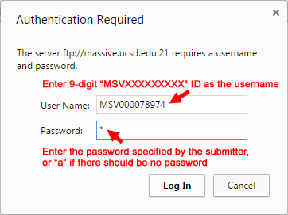

To search the public datasets available in the MassIVE repository, start by clicking on the “MassIVE Datasets” link in the top menu of the web site.

### Filtering and Sorting Datasets

On the datasets page, you will see a list of all current public datasets in the repository. This list is sorted by default in decreasing order of upload date (most recent first).

You can page through the list using the controls at the top, and you can also sort and filter by any column using the controls in the column headers. To filter, simply enter your search term in the box at the top of the relevant column, and then click “Filter”; multiple filters can be combined in this manner. Alternatively, you can select specific datasets by checking the boxes next to them, then check the “checked only” box, and then hit “Filter”, to reduce the list to only those rows that you want to see.

When you are ready to view the details of a particular dataset, just click on its green “MassIVE ID” link to load the [status page](#viewing-a-dataset) for that dataset.

### Viewing a Dataset

Once a dataset has been successfully submitted, its status page will update to a dataset details view. This page will show the dataset’s relevant metadata, as well as links to browse and download the actual dataset files themselves.

This page is usually reached from a MassIVE [public dataset search](#browsing-submitted-result-files), although it can technically be viewed by anyone with a direct link to its URL. In fact, if a dataset is still private, then direct linking is the only way to view it, since private datasets will never show up in public searches. In this way, private datasets can still be shared with relevant users (such as publication reviewers), while still maintaining reasonable privacy from the general public. See [here](submit_data.md#make-public) for more information about dataset privacy.

### Reviewer Access

If your dataset is private, and you wish to share it with colleagues such as journal reviewers, simply provide the dataset’s reviewer account login credentials. See here for more information.

### Dataset FTP Access

To view or download a dataset’s files, simply click on the “FTP Download” link on this page.

If you are asked to enter a username and password, then use the dataset ID and password as shown here:

Once you are connected to the dataset’s FTP directory, then the browser will bring up a listing of the dataset’s top-level directory, which can be navigated just like any directory listing.

Alternatively, you can simply copy the FTP URL and then paste it into your preferred FTP client program, which will then (after any relevant password authentication) provide the same access to the dataset’s files.

### Dataset Passwords

Technically, you must enter a password to access any dataset’s files by FTP. If the dataset is public, or is private but the submitter did not specify a password, then it should be accessible using the anonymous password “a”.

Try entering “a” as the dataset’s password if you want to view a public dataset and you are being challenged by the server for password authentication.

### Browsing Submitted Result Files

If a dataset is considered [“complete“](submit_data.md#MassIVEDatasetSubmission-SubmissionTypes), then its result files (spectrum identifications, peptides, proteins, etc.) are provided in a standardized format that MassIVE can parse and summarize for you. To browse these results, start by clicking on the “Browse Submitted Result Files” link on the dataset’s status page.

This will present a tabular summary of the dataset’s various result files. Here you can see how many rows of each type were found in (or derived from) each submitted result file, with the numbers also serving as links to the parsed results of that type.

Click on a link to view the results of the desired type, then all the usual [features of ProteoSAFe tabular result views](#filtering-and-sorting-datasets) are available – filtering, sorting, showing/hiding columns, etc.

For each row displaying a spectrum identification, you can click on the small spectrum image icon on the left to see an annotated visualization of it.

