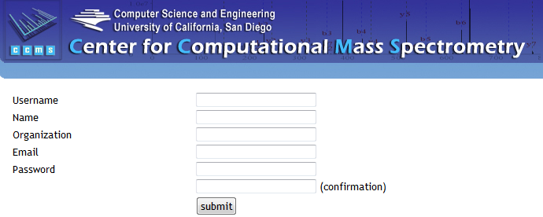

# Account Registration

The MassIVE data repository can be freely browsed and accessed by anonymous users, without having to register a user account. However, in order to actually submit datasets to the repository, a user account must be registered.

Account registration is a simple process, and completely private – MassIVE will never use your contact information for any reason other than to email you the outcome of your dataset submissions and other workflows.

To register an account, navigate to the MassIVE web site – [http://massive.ucsd.edu/ProteoSAFe/](http://massive.ucsd.edu/ProteoSAFe/). Here you will find a registration link in the upper right corner of the page, just below the login box.

Click on the registration link to bring up the account registration form.

Just fill out and submit this simple form, and your account is ready to use. You can then use this account to connect to MassIVE in two different ways:

1. You can log into the MassIVE web site by entering your username and password into the login box (as seen above). Once you are logged into the web site, you can upload data files, run file format conversion workflows, submit datasets, and everything you do will be saved to your account.
1. You can log into the MassIVE FTP server (_massive.ucsd.edu_) using the same username and password, giving you full FTP access to your account’s personal data space. This is the recommended method to upload and organize your data files for repository submission.

See [here](upload_data.md) for instructions on how to connect to and use FTP with your registered MassIVE account.
