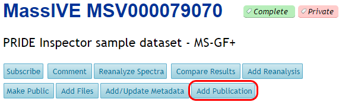
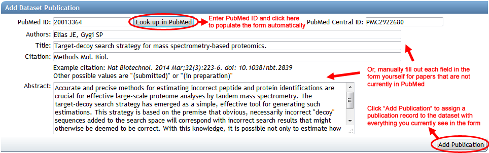

To associate a new publication with a dataset, click on the “Add Publication” link near the top of the status page.

This will open a form to describe the publication and add it to the dataset. A PubMed lookup service is provided for papers that are already published or in submission, although any of the form fields can also be manually filled out or edited.

