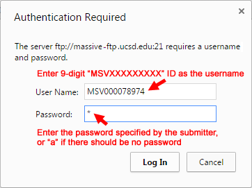

### FTP Download

The most reliable way to download files from a MassIVE dataset is via FTP. General instructions for choosing and setting up an FTP client program can be found in the dataset file upload documentation [here](upload_data.md).

Once your preferred client is ready, navigate to the FTP URL seen on the dataset's web page:

If the dataset is public, then the displayed FTP URL will be accessible anonymously, i.e. without requiring any kind of login to the MassIVE FTP server. However, if the dataset is still private then you will have to log in. This is illustrated on private dataset pages, where both the private and public FTP URLs are shown:

 **Note the "MSV...@" portion of the private FTP URL. This indicates the username that must be provided to log in to this private dataset. Some FTP clients recognize this portion of the URL and automatically fill in the username, and some don't. If prompted, just remember to use the full 9-digit MSV accession.**

When logging in to the MassIVE FTP server to download private dataset files, do NOT use your own account's username and password! Doing so will take you to your own account's private FTP directory - NOT that of the dataset.

---
> For private datasets, use these FTP login credentials:  Username: the dataset's 9-digit MSV accession Password: the password specified in the original submission (contact the dataset submitter to request access)

---

