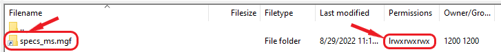

### MassIVE/GNPS Fair Use Policy - Frequently Asked Questions
1. **I thought MassIVE storage was permanent - does this mean the dataset accession mentioned in my manuscript might be deleted?**

    No - this policy only affects private user storage, i.e. the files that you upload directly to your MassIVE/GNPS account. Any files that you have already submitted to a MassIVE dataset or reanalysis, whether public or temporarily private (as is common while manuscripts are under review), do NOT count toward your account's storage quota and are NOT affected by this policy.

2. **How do I reduce my storage to comply with the policy?**

    You can easily reduce your private storage space using any of the following methods:

    - Submit your files to MassIVE (see documentation [here](submission_workflow.md)).
    - Use the "User Files" option on the website banner to view, sort and delete files/folders (see documentation [here](user_file_management.md)).
    - Use an FTP client, as is commonly used for large data transfers (see documentation [here](upload_data.md)).
    - Contact us at [ccms@proteomics.ucsd.edu](mailto:ccms@proteomics.ucsd.edu) if you feel that none of these options are suitable for your needs.

3. **I need to store my files for longer than 4 months. How can I do that?**

    If your circumstances are unique and you anticipate it will take longer than 4 months to prepare for an upcoming dataset submission, and you cannot store your files elsewhere, then please contact us at [ccms@proteomics.ucsd.edu](mailto:ccms@proteomics.ucsd.edu) and we will be happy to help find a suitable solution.

4. **I've reduced my storage to under 100 GB, but my account is still flagged as "Non-compliant". What do I do?**

    Simply log in to either the MassIVE or GNPS web portal and click the "User Files" link in the top banner menu to verify that your account is now compliant. The system will then check your account and automatically update its status. This may take some time, since the system will check all the files in your account.

5. **I followed the recommended steps to reduce my storage, but I'm still having problems. What do I do?**

    Please contact us at [ccms@proteomics.ucsd.edu](mailto:ccms@proteomics.ucsd.edu) and we will be happy to help you resolve any problems you might have.

6. **I have a lot of jobs. Do I need to delete these to bring my account into compliance?**

    Your jobs do take up space, but they do not count toward your account's fair use policy compliance. Only the files that you have directly uploaded to your account's private FTP directory affect this. You are free to run as many jobs as you like and take up as much space as you need with them.

7. **I'd like to delete some files to reduce my storage, but I don't want to accidentally delete anything I've already submitted to MassIVE.**

    As soon as any dataset submission job completes (i.e. as soon as you get an MSV accession), then all of the files you submitted in that job are fully removed from your account directory and replaced with read-only links to the permanent MassIVE files. We leave these links in your account in case you ever need to run additional online workflows on them. However, these links are read-only and take up no space.

    If you view your account via FTP, you will see these links as empty (0 bytes) files (sometimes shown as folders by certain FTP clients). Most FTP clients will indicate that these are links by displaying them with shortcut icons, or file/folder icons decorated with small arrows. For example, in FileZilla:

    

    The folder icon with an arrow, and the "l" at the beginning of the permissions string, indicate that this is a link - i.e. not a real file but just a read-only shortcut to the permanent dataset file in the MassIVE repository.

    If you choose to delete these links from your account then your submitted MassIVE files are safe. Once a file is submitted to MassIVE (even while the dataset is still private), it is no longer owned by your account and you cannot edit or delete it, even if you try. It is permanently protected until you request that we delete it for you. Deleting the links only removes them from your account, and has no effect on the permanent MassIVE files that they point to.

    That being said, since these links take up no space and therefore have no effect on your account's fair use policy compliance, you can also just safely leave them there and not worry about them.

    Any other file you see in your account (not shown as a link, and with a file size of greater than 0 bytes) is a real file that has never been submitted to any MassIVE dataset. These are the files that do count toward your account's fair use policy compliance, so these are the ones that you want to either submit in a new dataset or delete until your account's total storage occupancy is no more than 100 GB.

    Finally, the [user files management web interface](user_file_management.md) does not display any links, so whatever you see there is a real file that counts toward your account's fair use policy compliance. This can be helpful to filter out the links if your account contains many of them.
