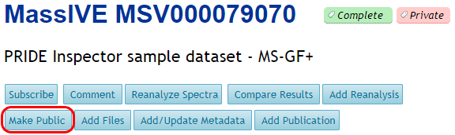

# Make Public

Any time after a dataset is submitted, the submitter can choose to make it public by clicking on the “Make Public” link near the top of the dataset page.

When this happens, the dataset is affected in the following ways:

*   It appears in [public dataset searches](access_public_datasets.md#MassIVEDatasetBrowsing-Searching) on the MassIVE web site.
*   If the submitter specified a [password](#MassIVEDatasetSubmission-Privacy) for the dataset, then this password is removed, and is replaced by the anonymous password “a”.
*   If the submitter checked the “[Submit to ProteomeXchange](#MassIVEDatasetSubmission-Publication)” checkbox, then a ProteomeXchange announcement message is submitted, and the dataset will appear in the list of public datasets at [ProteomeCentral](http://proteomecentral.proteomexchange.org/cgi/GetDataset).
