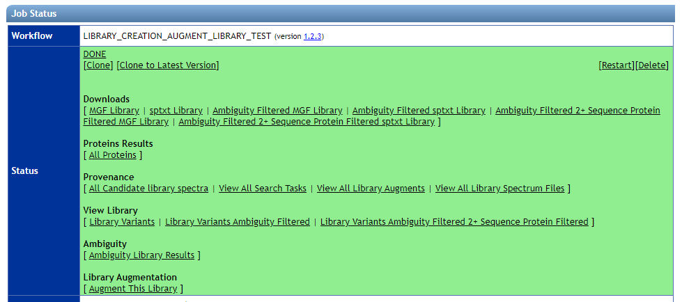
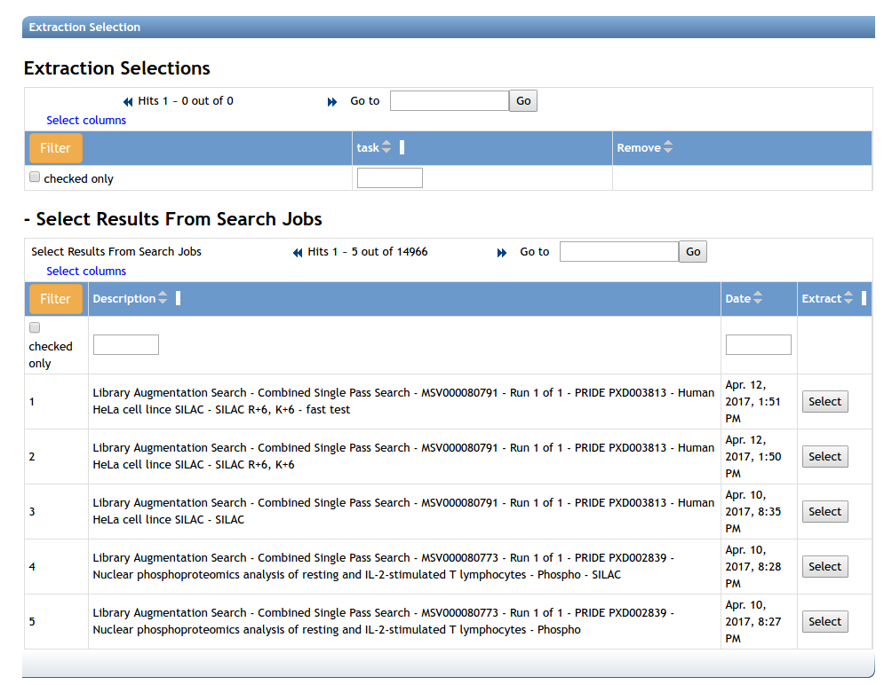
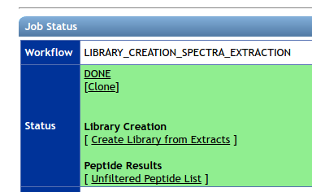
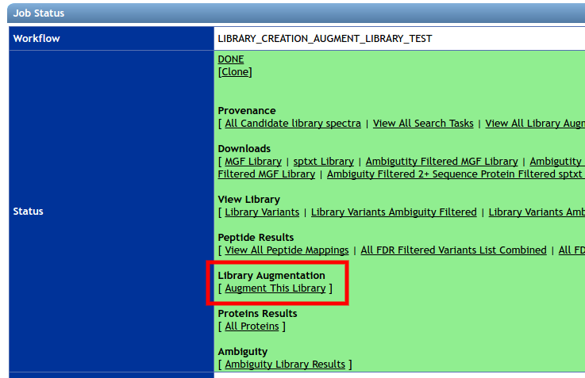
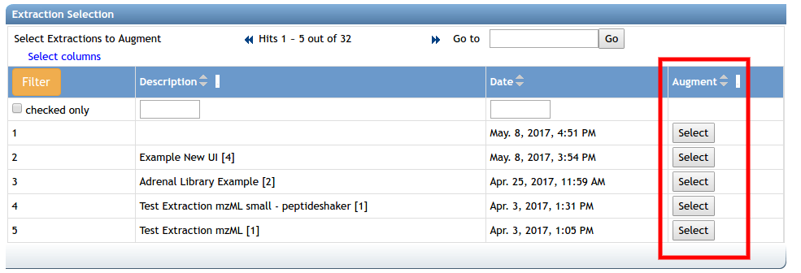

The MassIVE Knowledge Base (MassIVE-KB) is a set of peptide spectral libraries. They are distilled from 31TB of human proteomics HCD data. Users can peak at the inside of these libraries, browse the source data, and track full provenance of analysis tasks that created these libraries. 

## Browsing Libraries

You can browser MassIVE-KB libraries to explore what is in them, and what is the provenance. Here is a view of the status page of a massive-kb library:

The following views are described

| View | Description |
| ---- | ----------- | 
| View Library - Library Variants | All Library Spectra at 1% local precursor FDR | 
| View Library - Library Variants Ambiguity Filtered | Library spectra filtered for ambiguity spectra |
| View Library - Library Variants Ambiguity Filtered 2+ Sequence Protein Filtered | Library spectra filtered to only proteins that included 2 sequences that uniquely mapped to proteins after considering SAAVs |
| Provenance - All Candidate library spectra | View top 100 spectra that were candidates for inclusion in the library for each precursor. Includes provenance links back to original search and spectrum file. |
| Provenance - View All Search Tasks| List of all search tasks that were used to in the construction of library| 
| Provenance - View All Library Augments | List of augment tasks that incrementally included more spectra in library throughout time. | 
| Provenance - View All Library Spectrum Files | List of all input spectrum files that were searched to be included in spectral library. | 
| Protein Results - All Proteins  | Protein with FDR calculated from precursors after ambiguity filtered. | 
| Ambiguity - Ambiguity Library Results  | List of library spectra and the number of identifications for each | 
| Library Augmentation - Augment This Library | Link to augment existing library. Takes you to selection page to add new spectra to grow library. | 
| Downloads - MGF library  | Annotated MGF Library download of full MassIVE-KB library | 
| Downloads - sptxt library | Annotated sptxt Library download of full MassIVE-KB library for use with Trans Proteomics Pipeline and Skyline | 
| Downloads - Ambiguity Filtered MGF Library| Annotated MGF Library download of full MassIVE-KB library with ambiguously identified spectra filtered out | 
| Downloads - Ambiguity Filtered sptxt Library | Annotated sptxt Library download of full MassIVE-KB library with ambiguously identified spectra filtered out | 
| Downloads - Ambiguity Filtered 2+ Sequence Protein Filtered MGF Library | Annotated MGF library filtered to only proteins that included 2 sequences that uniquely mapped to proteins after considering SAAVs | 

## Using Libraries

These spectral libraries can be:

1. Downloaded as MGF in external programs (e.g. MSPLIT)
1. Downloaded as MSP/SPTXT in external programs (e.g. SpectraST)
1. Downloaded as JSON
1. Searched in MassIVE (e.g. Maestro, MSPLIT)

## Creating Your Own

You can create your own spectral libraries with our MassIVE-KB pipelines. 

There are three distinct steps in the creation of MassIVE-KB spectral libraries.

1. Database Searching
1. Spectra Extraction/Quality Filtering
1. Library Creation/Augmentation

### Database Searching Proteomics Data for Library Creation

Users can utilize a modified MSGF+ search workflow available at the Center for Computational Mass Spectrometry available [here](https://proteomics2.ucsd.edu/ProteoSAFe/?params=%7B%22workflow%22:%22MSGF-PLUS-AMBIGUITY%22%7D). Users may choose any public or private data they have access to and search with appropriate parameters.

#### Synthetic Spectral Data Searching

To search a synthetic peptide pool, please use this [workflow](https://proteomics2.ucsd.edu/ProteoSAFe/?params=%7B%22workflow%22:%22MSGF-PLUS-SYNTHETIC%22%7D). The parameters are nearly identical to MSGF+, but there are additional options. Specifically, users should add some background spectra that is not of the primary peptide pool to be identified. Users then will specify the “target_run_filename” as the full file name of the spectrum file to be identified. Identifications to other spectrum files are called decoys. Additionally, the set of peptides that that are in common between the target spectrum file and background spectrum files will be specified in “blacklisted_decoy_peptides_json” as a list of peptide strings in json format. Finally, users must enter the acceptable collision energies in the “acceptable_collision_energies” in a semicolon separated string format. All other collision energies are ignored.

### Spectra Extraction/Quality Filtering

After the searches are finished, the identified spectra are extracted from the original mzXML/mzML files and quality filtered. A set of search jobs can be extracted at once using this [workflow](https://proteomics2.ucsd.edu/ProteoSAFe/?params=%7B%22workflow%22:%22LIBRARY_CREATION_SPECTRA_EXTRACTION%22%7D). To select searches to extract, select an appropriate search job from the jobs list. Any jobs run by the specific user may be selected.

### Library Creation of a New Library

To create a library from an existing spectra extraction workflow, please click the “Create Library from Extracts” link. It will take you to this [workflow](https://proteomics2.ucsd.edu/ProteoSAFe/?params=%7B%22workflow%22:%22LIBRARY_CREATION_AUGMENT_LIBRARY_TEST%22%7D) with selections pre-populated. 

The default parameters are appropriate for human HCD proteome parameters, adjust accordingly for your data.

### Library Augment of an Existing Library

To augment an existing library, on the status page of the existing spectral library, please click the “Augment This Library” link.

This brings users to a library augment workflow page. Please select a spectra extraction job from the jobs table to augment to the existing library. Only one extraction can be augmented to a library at one time.

The default parameters are appropriate for human HCD proteome parameters, adjust accordingly for your data.

## License

All MassIVE-KB Reference spectra will have the [CC0](https://creativecommons.org/publicdomain/zero/1.0/) license.