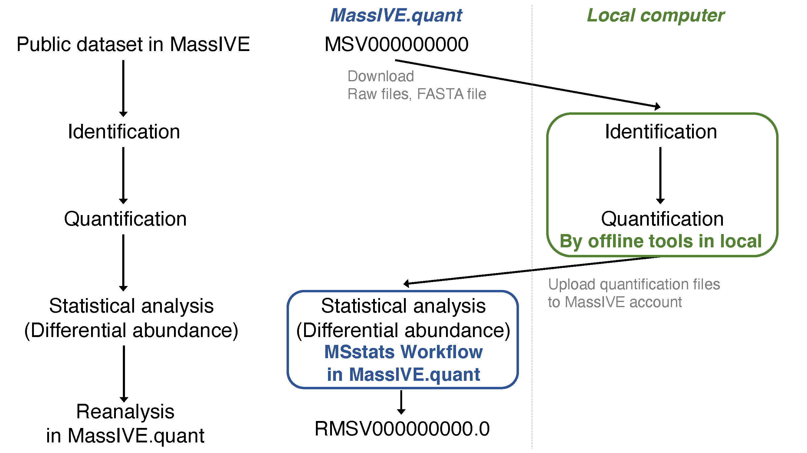
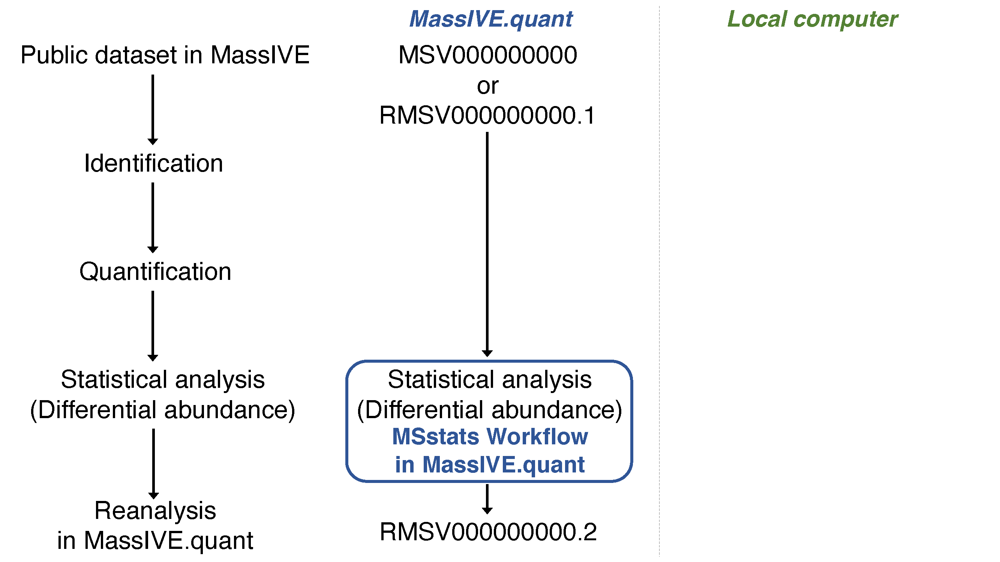

Before you run **MSstats workflow**, quantification files(reports) from data processing tools should be ready. 

### 1.1 Option1: Upload New Quant
You can perform **MSstats workflow** for a new quantification.

If you have a new quantification file, start by uploading your quantification files to your MassIVE account.

Uploading data for MassIVE repository submission is the general procedure for any data submission in MassIVE repository.
Please follow the instruction on [how to upload data for MassIVE repository](https://ccms-ucsd.github.io/MassIVEDocumentation/submit_data/).

Then, move on to **Step 2: MSstats workflow**.

### 1.2 Option2: Use Published Quant

You can perform **MSstats workflow** using a quantification already published in MassIVE.quant.

If you know the MSV ID or RMSV ID, including quantification files, you are ready to move on to **Step 2: MSstats workflow**.
