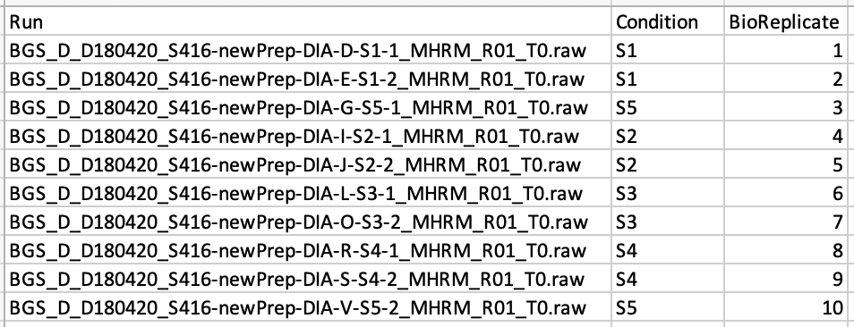
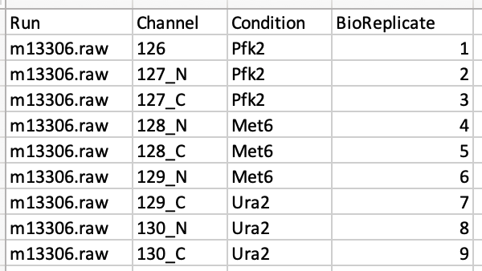
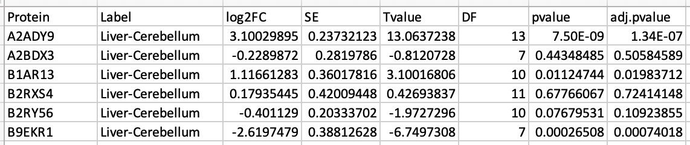

### What files are required for MassIVE.quant?

To reproduce quantitative workflow, **MassIVE.quant requires data (files) in three collections** of MassIVE: 1. Metadata, 2. Quantification, and 3. Statistical Analysis of Quantified Analytes. Here are the detailed required information for each collection.

### 1. Metadata
* File format - a tabular format : i.e., csv, txt, tsv
    * **!! Note** : xls file with multiple sheets can not be parsed. Please prepare each sheet as a separate file.
    
* Minimum required columns: 
    * **!! Note** : Column headers should be matched as below.
    * **Run** : This column contains the identifier of a mass spectrometry run. Each mass spectrometry run should have a unique identifier, regardless of the origin of the biological sample. It could have Raw file names. 
    * **Condition** : This column indicates groups of interest (such as “Disease” or “Control”) or time points (such as “T1”, “T2”, etc).
    * **BioReplicate** : This column should contain a unique identifier for each biological replicate in the experiment. For example, in a clinical proteomic investigation this should be a unique patient id. Patients from distinct groups should have distinct ids. If the technical replicates are present, all samples or runs from a same biological replicate should have a same id.
    * **Channel** : This is only for iTRAQ or TMT experiment. This column contains labeling information (126, ... 131) for iTRAQ and TMT. It should be consistent with the channel columns in quantification. For MaxQuant output, the value of this column should have channel.0, channel.1, and so on. 
    
* Addition columns for complex experimental design:
    * **Fraction** : One technical replicate of one sample or TMT mixture may be fractionated into multiple fractions to increase the analytical depth. Then one technical replicate of one sample or TMT mixture should correspond to multiple fractions. 
    * **TechReplicate** : Technical replicate of one sample. One sample may have multiple technical replicates. For example, `TechReplicate` = 1  or 2 for the two technical replicates of one sample, then they should have the same `Condition` and `BioReplicate` values.
    * **TechRepMixture** : Technical replicate of one TMT mixture. One mixture may have multiple technical replicates. For example, if `TechRepMixture` = 1, 2 are the two technical replicates of one mixture, then they should match with the same `Mixture` value.
    * More information is welcome.

* Example
    * Label-free DDA, DIA, or SRM 

    * DDA with chemical labeling (TMT) 

###  2. Quantification
* File format - a tabular format : i.e., csv, txt, tsv, xls
    * **!! Note** : xls file with multiple sheets can not be parsed. Please prepare each sheet as a separate file.

* There are no required columns. Every tool reports the quantification with different column headers. Any quantification for feature-level, peptide-leve, or protein-level, which you used for downstream analysis, should be submitted in this collection.

* Examples for some data processing tools
    * Skyline : MSstats input.csv 
    * MaxQuant : evidence.txt, proteinGroups.txt, peptides.txt or Phospho (STY)Sites.txt
    * Progenesis : PSM-level quantification
    * Proteome Discoverer : peptide/PSM or protein-level report as txt files
    * Spectronaut : .xls file from ‘MSstats scheme (v3.7.3)’
    * DIA-Umpire : FragSummary.xls, PeptideSummary.xls, ProtSummary.xls

###  3. Statistical Analysis of Quantified Analytes
* File format - a tabular format : i.e., csv, txt, tsv, xls
    * **!! Note** : xls file with multiple sheets can not be parsed. Please prepare each sheet as a separate file.

* There are no required columns. The diverse statistical analyses report the different information. The tabular format of output for statistical analysis should be submitted in this collection. If the output is not tabular format, please submit it in the `Supplementary` collection.

* Example files for differential abundance analysis 
    * Protein : Protein ID
    * Label : Comparison between groups of conditions (ex. Disease-Healthy or Disease vs Healthy) or time points (ex. T1-T0, 60mins - 0 min)
    * pvalue : p-value
    * adj.pvalue : adjusted p-value
    * Example of output from MSstats R package

###  (Optional) Additional file 
We recommend that you submit additional files to reproduce the quantitative workflow in `Method and Protocol` or `Supplementary` collection.

* Examples for some data processing tools or statistical analysis
    * Parameter or configuration files > `Method and Protocol` collection
        * Parameter.txt or mqpar.xml from MaxQuant 
        * Log file from MSstats R package
    * Tool-specific files > `Supplementary` collection
        * Skyline : sky, skyd, sky.zip, blib, irtdb, protdb, optdv, and midas
        * Spectronaut : .sne, .kit
        * Proteome Discoverer : .pdResult, .pdStudy
    * Command-line script > `Method and Protocol` collection
        * R or python script
