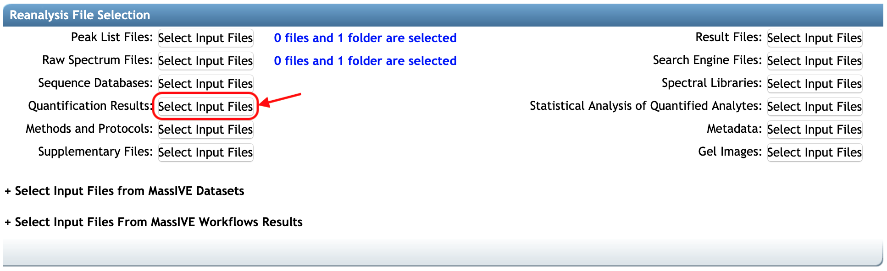
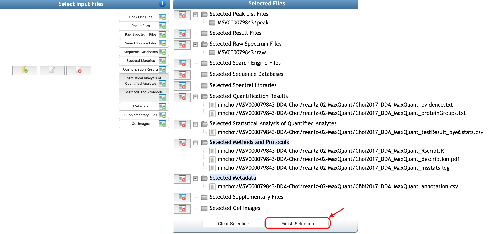

Once your files are fully uploaded to your user account directory at MassIVE, you are ready to submit your files as a reanalysis. 

### 2.1 Select Dataset

First, go to the webpage for the dataset you reanalyzed. You can search dataset MSV ID or PXD ID in [dataset's web page](../access_public_datasets.md#MassIVEDatasetBrowsing-ViewingaDataset).

click the **Add Reanalysis** button:

### 2.2 Workflow Selection and Reanalysis Metadata Sections

**Add Reanalysis** button brings you to a MassIVE reanalysis attachment workflow input form.
At this point, the option **'MassIVE Dataset: Add Reanalysis Results'** should be automatically selected in the `Workflow`. Information regarding `Species`, `Instrument`, `Post-Translation Modifications` should also be filled automatically, based on the original submission. You should add 

1. the title in `Title` (at least 30 characters)
2. the description for this reanalysis in `Description` (at least 50 characters)

Example of a `Title`: 'MassIVE.quant reanalysis from offline MaxQuant+MSstats results'
Example of a `Description`: 'MassIVE.quant reanalysis of data from the iPRG2015 study (dataset MSV000079843) using Andromeda for identification and MaxQuant for quantification, followed by MSstats for statistical analysis of differentially abundant proteins.'

### 2.3 Reanalysis File Selection section 
You should select all the files for your reanalysis by clicking any of **Select Input Files** buttons:

Next, the file selection pop-up window (below) helps you browses your account to select the files you uploaded, as well as any other files you wish to attach for this reanalysis. The original dataset should be automatically imported at this stage. You can see that Raw spectrum files and Peak list files which are available in MSV are already selected. At least one of Raw spectrum files from the original MSV should be selected to link this reanalysis with the original dataset.

### Categories for Quant files (IMPORTANT!!)
You should select valid reanalysis files in this step. Please choose the proper category for each file. Here is more help on each of the individual categories for quantification and statistical analysis results.

| Category                                     | Notes                                                                                    |
| -------------------------------------------- | ---------------------------------------------------------------------------------------- |
| Quantification results                       | Quantification result files (reports) from data processing tools/quantification tools. It should be used for downstream statistical analysis. For example, PSM-level, transition-level, or protein-level quantified peak intensities data should be saved in this category.  |
| Metadata                                     | Information about the design of experiments should be submitted in the `Metadata` section. For example, an annotation file for MSstats should have the information about biological replicate, technical replicate, fraction, condition, or group for the corresponding MS runs and corresponding channels. This annotation file should be saved in this category.|
| Statisitical analysis of quantified analytes | Files including the results for statistical analysis. It could be the table or figure of the result for statistical analysis. For example, table (.txt, .csv), r data format for differential abundance analysis, or pdf for figures can be saved in this section. |
| Methods and Protocols                        | Any open-format files containing explanations or discussions of the xperimental procedures used to analyze this reanalysis. For example, R script used for this reanalysis, log files, or txt or xml files to record a version of tool/software or parameters used in tool/software. Even the pdf, including the experimental procedure in the publication. |
| Supplementary                                | Any other type of information. For example, the software-specific files from processing software can be shared in this section (sky, skyd, sky.zip, blib, irtdb, protdb, optdb, and midas for Skyline, .pdresult for Proteome Discoverer, .sne for Spectronaut).|

### Examples: input and output using MSstats 

Here are the examples of quantification files as the input of MSstats, the output of MSstats for statistical analysis, and their corresponding categories to submit.

| Data processing tool | File type                | File Selection Category                     |
| -------------------- | ------------------------ | ------------------------------------------- |
| All                  | input.csv                | Quantification results                      |
|                      | annotation.csv           | Metadata                                    |
|                      | testResult_byMSstats.csv | Statistical analysis of quantified analytes |
|                      | msstats.log              | Methods and protocols                       |
|                      | Rscript.R                | Methods and protocols                       |
|                      | Description.pdf          | Methods and protocols                       |
| MaxQuant             | evidence.txt             | Quantification results                      |
|                      | proteinGroups.txt        | Quantification results                      |
|                      | parameters.txt           | Quantification results                      |
|                      | mqpar.xml                | Methods and protocols                       |
|                      | fasta                    | Sequence database                           |
| Spectronaut          | input.xls                | Quantification results                      |
|                      | SpectronautAnalysis.sne  | Supplementary files                         |
| DIA-Umpire           | FragSummary.xls          | Quantification results                      |
|                      | PeptideSummary.xls       | Quantification results                      |
|                      | ProtSummary.xls          | Quantification results                      |
| OpenSWATH            | input.tsv or input.txt   | Quantification results                      |
| Skyline              | .sky.zip                 | Supplementary files                         |

### How to select the file(s) and category
If you know which category should be selected for each file, let's start. Here is the example for `Quantification Results`.

1. Select file(s): *'Choi2017_DDA_Skyline_input.csv'* is the MSstats report from Skyline, which is precursor-level quantified data. It should be saved in `Quantification Results`. Click the file name(s) under your MassIVE account. Then file(s) will be highlighted.
2. Select category: at the top-left corner, there are boxes for categories. Select (or Click) the box named `Quantification Results`.
3. Then, on the right panel, named `Selected Files`, you can see the selected file(s) under the folder named `Selected Quantification Results`.

Repeat the same steps for other files.

Once you've selected valid reanalysis files and proper categories, click **Finish Selection** button. 

Then, you will be back to reanalysis attachment workflow input form.

**_!! NOTE: To browse the dataset in MassIVE.quant, the three categories, 1) Quantification Results, 2) Metadata, 3) Statistical Analysis of Quantified Analytes, should have the file(s)._**

### 2.4 Reanalysis Container Selection section

The reanalysis attachment workflow will determine which source datasets were reanalyzed, and will then prepare what's referred to as a "reanalysis container" for your attachment. A reanalysis container simply refers to the unique set of datasets that were reanalyzed - usually only one, but possibly more. The workflow then attaches your results to this container. Any other reanalysis results attached (by any user) to this same set of datasets will also go in the same container.

For example, `Reanalysis Container` shows all containers for the source dataset. You can choose one of them or make *New reanalysis container*. If you select **New reanalysis container**, then you should put the title for this container in `Reanalysis Container Title`.

### 2.5 Workflow Submission section

Finally, you are ready to submit. Please type your email to get progress notice and click **Submit** button.

Then, you will move to the new page, which shows the progress. Please wait. It will take a few minutes. After the job is done, you will get the notification email.

