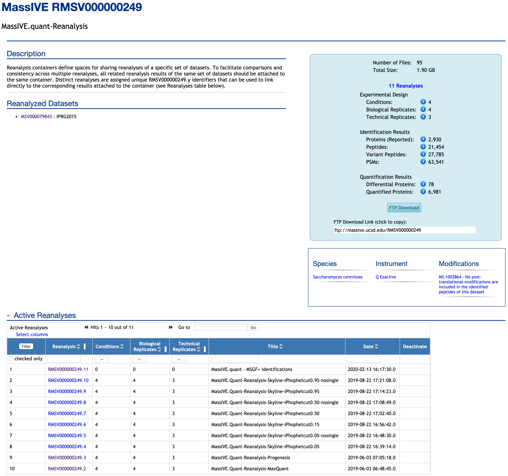
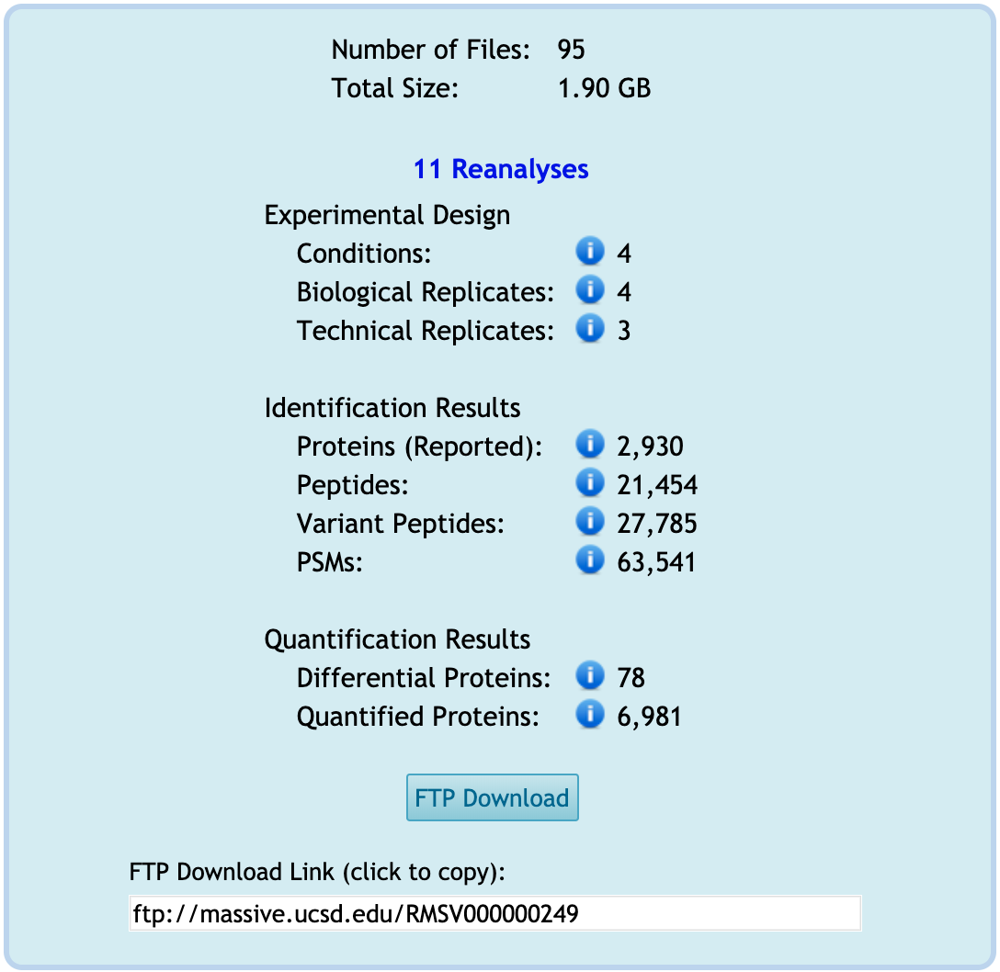

Each container, including at least one reanalysis, has its page. Here is the example of one container, RMSV000000249. It includes reanalysis (RMSV000000249.1).

If there are multiple experiments in one MSV or PXD, we can specify one experiment in one container.

### Container page
If you know the container ID, such as RMSV0000249, you can search in the main MassIVE webpage. Also, you can access the container from the dataset, for example, MSV000079843 for this container.

### Title

It shows the title that the submitter provided in the `Add Reanalysis Results` workflow, for this container, 'MassIVE.quant-Reanalysis'.

### Description

This description is automatically filled by MassIVE.

### Reanalyzed Datasets

It shows the datasets reanalyzed for this container. This container belongs to this dataset. For this container, the reanalyses under this container have used the datasets from the data, MSV000079843. If you click the MSV ID, you will move to the dataset webpage.

### Active Reanalyses

At the bottom of this page, there is a table to show the list of reanalyses in this container. For this example, there are 11 reanalyses available in this container. Each reanalysis has an RMSV ID with the suffix in the container RMSV ID. One reanalysis (RMSV000000249.11) includes an identification searching result. The rest of 10 reanalyses include statistical analysis for quantification by different tools or parameters.

### Summary table for this container

There is the summary box on the left of this page. It shows the simple summary of experimental design, identification result, and quantification/statistical analysis for this reanalysis.

1. **Experimental Design**: The summary of detected experimental design from the `Metadata` category.

    - **Conditions**: Number of distinct conditions across all reanalyses in this container. Distinct condition labels are counted across all files submitted in the `Metadata` category having a `Condition` column in this container's reanalyses. For this container, there are four conditions across all files in the `Metadata` category in this container's reanalyses.

    - **Biological Replicates**: Number of distinct biological replicates across all reanalyses in this container. Distinct replicate labels are counted across all files submitted in the `Metadata` category having a `BioReplicate` or `Replicate` column in this container's reanalyses. For this container, four unique IDs for biological replicates are available across all 'annotation.csv' files in the `Metadata` category in this container's reanalyses.

    - **Technical Replicates**: Number of distinct technical replicates across all reanalyses in this container. The technical replicate count is defined as the maximum number of times any one distinct combination of condition and biological replicate was analyzed across all files submitted in the `Metadata` category. In the case of fractionated experiments, only the first fraction is considered. For this container, a maximum of three technical replicates for the corresponding biological replicate is available across all reanalyses in this container.

2. **Identification Result**: The summary of the identifications from searching the dataset in `Result Files` category.

    - **Proteins (Reported)**: Number of distinct protein accessions reported across all reanalyses in this container.
    
    - **Peptides**: Number of distinct unmodified peptide sequences reported across all reanalyses in this container.
    
    - **Variant Peptides**: Number of distinct peptide sequences (including modified variants or peptidoforms) reported across all reanalyses in this container.
    
    - **PSMs**: Total number of peptide-spectrum matches (i.e. spectrum identifications) reported across all reanalyses in this container.

3. **Quantification Result**: The summary of the result for statistical analysis from `Statistical Analysis of Quantified Analytes` category.

    - **Differential proteins**: Number of distinct proteins found to be differentially abundant in at least one comparison across all reanalyses in this container. A protein is differentially abundant if its change in abundance across conditions is found to be statistically significant with an adjusted p-value <= 0.05 and lists no issues associated with statistical tests for differential abundance . Distinct protein accessions are counted across all files submitted in the `Statistical Analysis of Quantified Analytes` category having a `Protein` column in this container's active reanalyses. For this container, there are 10 reanalyses, including the table for the result of statistical analysis in the `Statistical Analysis of Quantified Analytes` category, 78 distinct protein accessions are significantly different for at least one pairwise comparison across 10 reanalyses.

    - **Quantified proteins**: Number of distinct proteins quantified across all reanalyses in this container. Distinct protein accessions are counted across all files submitted in the `Statistical Analysis of Quantified Analytes` category having a `Protein` column in this container's active reanalyses. For this container, 6,981 distinct protein accessions were quantified and tested by MSstats across 10 reanalyses in this container.
    

### [Button : FTP Download](2_download_files.md)

All the submitted files in the reanalysis are available for downloading from FTP. See [here](2_download_files.md) for detailed instructions on how to download the files in any category.

