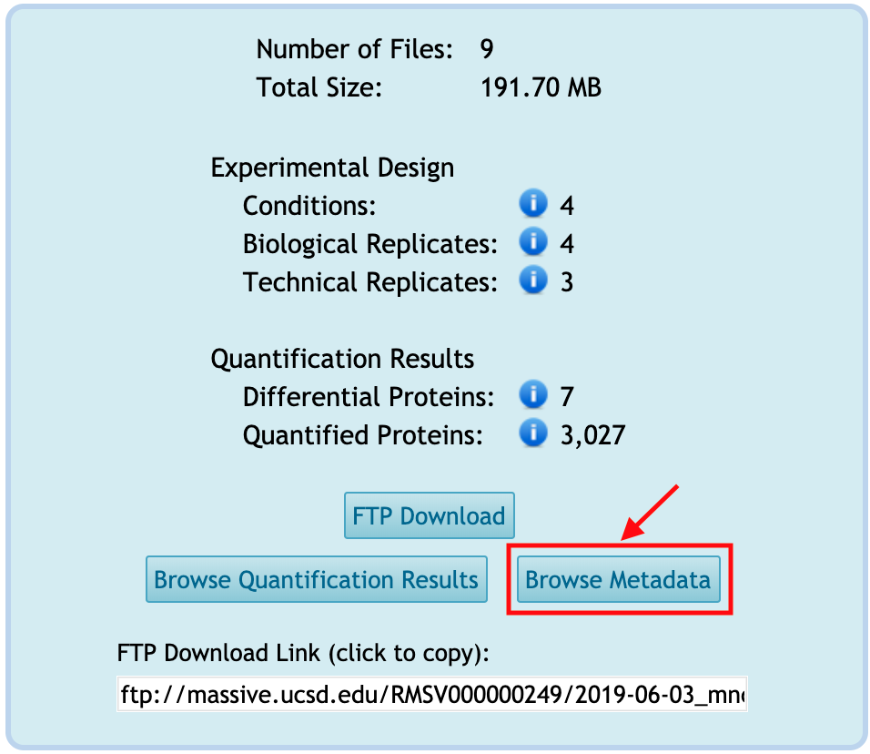
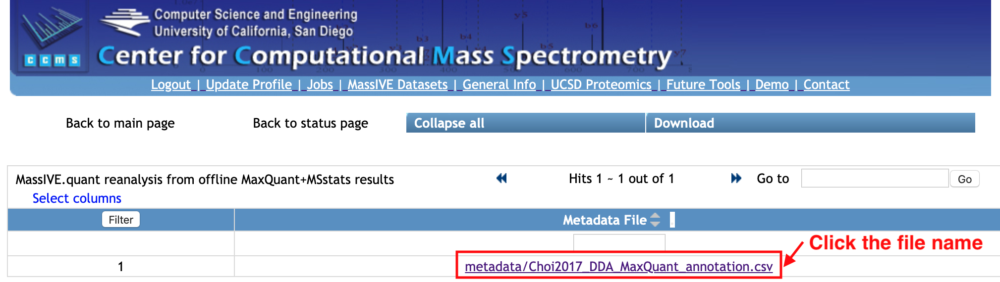
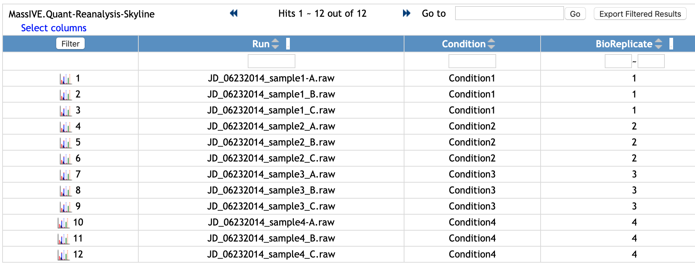
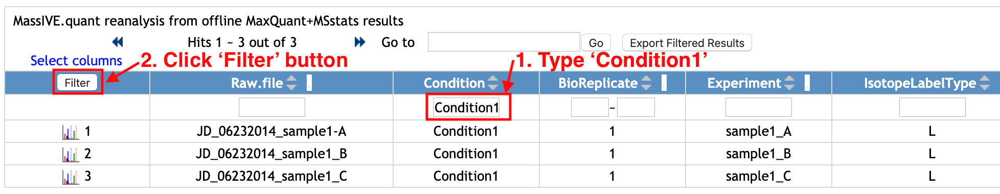
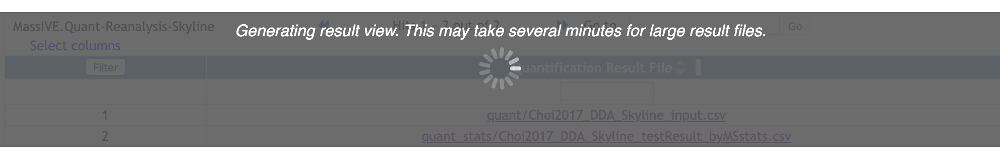
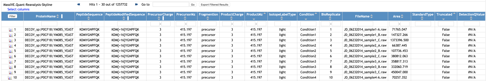
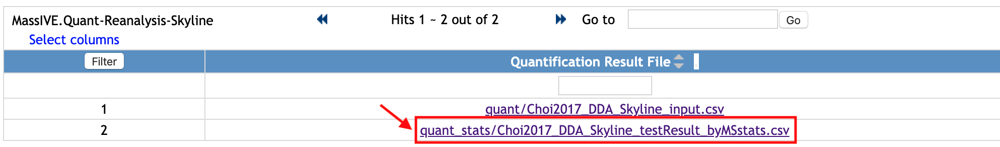
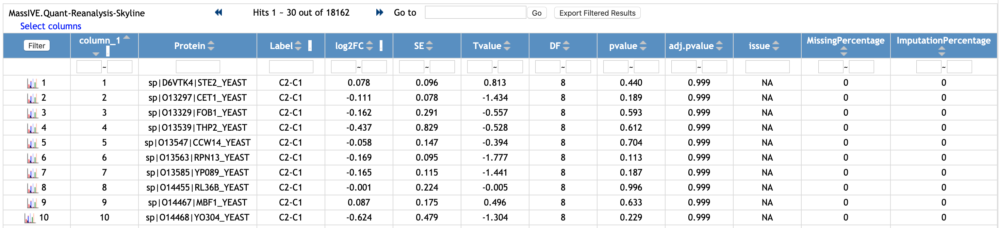
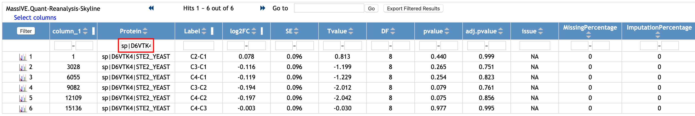
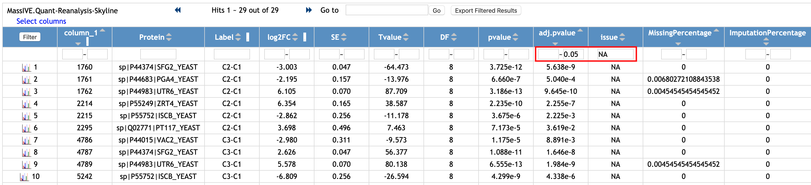

### Browse Metadata

You can browse the metadata for the reanalysis by clicking on **Browse Metadata** from the reanalysis webpage. This button is activated only when any tabular-type file(s) is available in `Metadata` category.

You will move to the new webpage to show the list of files under `Metadata` category.

Select one file name and it will show how the file looks like. This is the example of annotation file for MSstats, which requires *Run* or *Raw.file*, *Condition*, *BioReplicate*. It can have many additional columns.

You can filter the rows. Let's check the rows for 'Condition1'.

1. Type 'Condition1' in the empty box in the first row and below the column named 'Condition'.
2. Click `Filter` button at the top left of table.

Then, the rows with 'Condition1' for `Condition` column are shown. For this example, there are three Runs from 'Condition1'.

If you want to remove filter and to see the whole table, remove 'Condition1' that you typed and click the same `Filter` button again.

### Browse Quantification Results

You can browse the quantification results for the reanalysis by clicking on **Browse Quantification Results** from the reanalysis webpage. This button is activated only when any tabular-type file(s) is available in `Quantification Results` or `Statistical Analysis of Quantified Analytes` categories.

You will move to the new webpage to show the list of files under `Quantification Results` or `Statistical Analysis of Quantified Analytes` categories.

Select one file, named _quant/Choi2017_DDA_Skyline_input.csv_. This file was submmited to `Quantification Results`. 

***Note***: The file size of quantification result could be big. If the webpage shows like below, please wait little more.

This is the example of quantification result (MSstats reports) from Skyline. 

Let's see another file. Select one file, named _quant_stats/Choi2017_DDA_Skyline_testResult_byMSstats.csv_. This file was submitted to `Statistical Analysis of Quantified Analytes`. 

This is the example of the output of MSstats, using the quantification result from Skyline (named _Choi2017_DDA_Skyline_input.csv_, the file shown above).

You can filter the rows. Let's check the rows for protein named 'sp|D6VTK4|STE2_YEAST'.

1. Type 'sp|D6VTK4|STE2_YEAST' in the empty box in the first row and below the column named 'Protein'.
2. Click `Filter` button at the top left of table.

Then, the rows with 'sp|D6VTK4|STE2_YEAST' for `Protein` column are shown. There are six rows with different `Label`, which shows different pairwise comparisons

If you want to remove filter and to see the whole table, remove 'sp|D6VTK4|STE2_YEAST' that you typed and click the same `Filter` button again.

Let's check the rows with significantly different proteins and comparisons.

1. Type '0.5' in the second empty box in the first row and below the column named 'adj.pvalue'.
2. Type 'NA' in the empty box in the first row and below the column nammed 'issue'.
2. Click `Filter` button at the top left of table.

Then, the rows with siginificantly differential abudunce are shown. There are 29 rows shown. Among 29 rows, there are 7 unique proteins.

