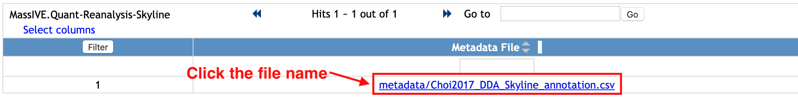

### Browse Metadata

You can browse the metadata for the reanalysis by clicking on **Browse Metadata** from the reanalysis webpage **(??? only from reanalysis webpage)**:

**_todo : 1) new capture for summary table+ only red box mark_**

You will move to the new webpage to show the list of files under `Metadata` category.

Select one file name and it will show how the file looks like. This is the example of annotation file for MSstats, which requires *Run* or *Raw.file*, *Condition*, *BioReplicate*. It can have many additional columns.

You can filter the rows. Let's check the rows for 'Condition1'.

1. Type 'Condition1' in the empty box in the first row and below the column name, 'Condition'.
2. Click `Filter` button at the top left of table.

Then, the rows with 'Condition1' for `Condition` column are shown. For this example, there are three raw files from 'Condition1'.

If you want to remove filter and to see the whole table, remove 'Condition1' that you typed and click the same `Filter` button again.

### Browse Quantification Results

You can browse the quantification results for the reanalysis by clicking on "Browse Quantification Results" from the reanalysis page:

**_todo : 1) new capture for summary table+red box mark_**

You will move to the new webpage to show the list of files under `Quantification Results` or `Statistical Analysis of Quantified Analytes` categories.
**_todo : 2) new capture for metadata page : list of files_**

Select one file, named xxx. It is under `Quantification Results`. This is the example of quantification result (MSstats reports) from MaxQuant. 

**_todo : 2) new capture for metadata webpage_**

Select one file, named xxx. It is under `Statistical Analysis of Quantified Analytes. This is the example of the output of MSstats, using the quantification result from MaxQuant (named xxx, the file shown above).

**_todo : 2) new capture for metadata webpage_**
