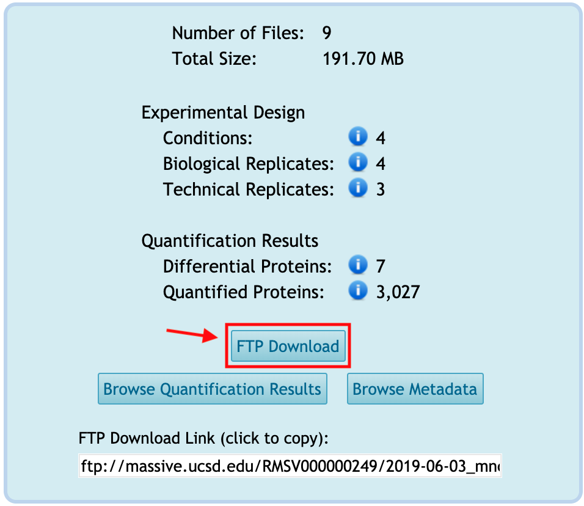
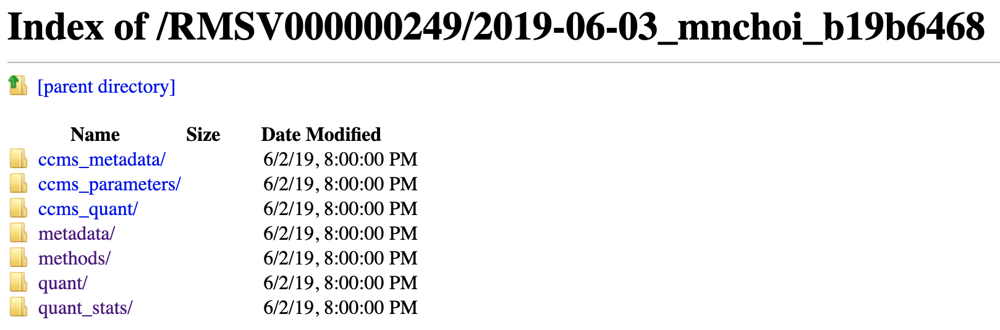
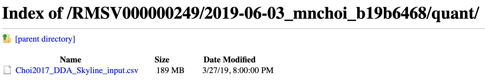
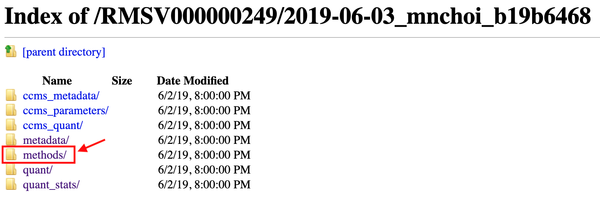
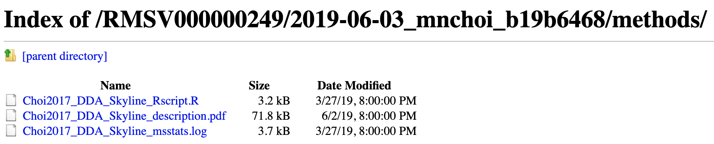

All the submitted files in the reanalysis are available for downloading from FTP.

Click **FTP Download** button.

It browse the FTP. Each folder is for category. Let's go to **quant/** folder, which means `Quantification Results` category.

Then, you can see all files under `Quantification Results` category.

Click the file named _Choi2017_DDA_Skyline_input.csv_. Then this file will be downloaded in your computer.

Let's go one page back and then go to **methods/** folder, which means `Methods and Protocol` category.

Then, you can see all files under `Methods and Protocol` category. There are Rscript used for statistical analysis, pdf including the data analysis steps, log file recorded the version of MSstats and parameters. If you download R script and other files in `Quantification Results`, you can reproduce the same statistical result.

