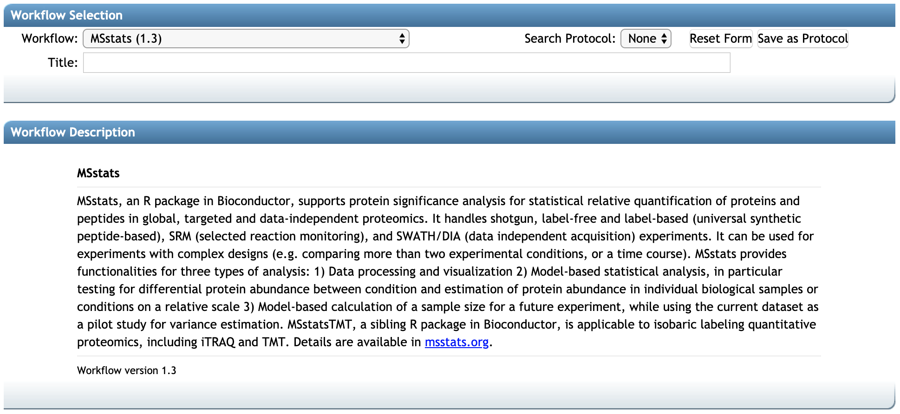
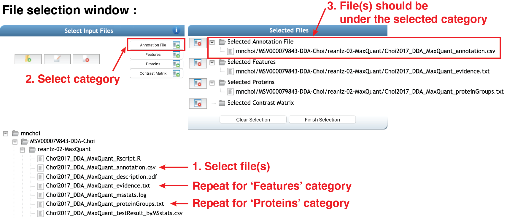
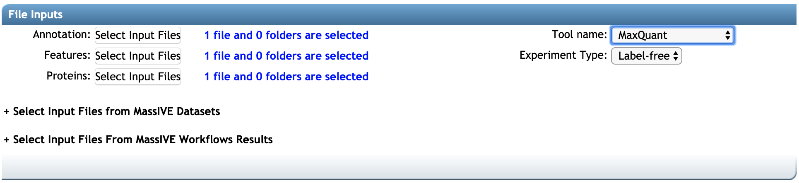
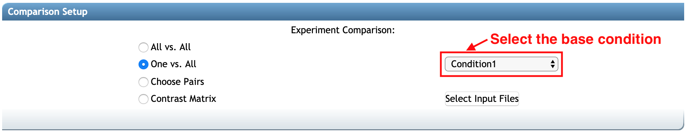
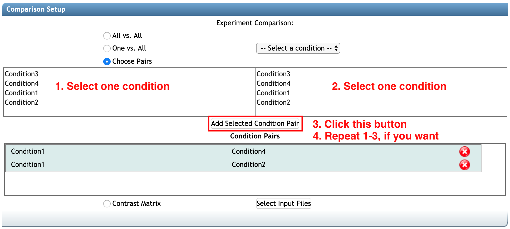
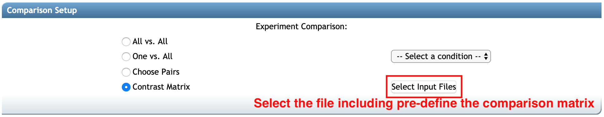
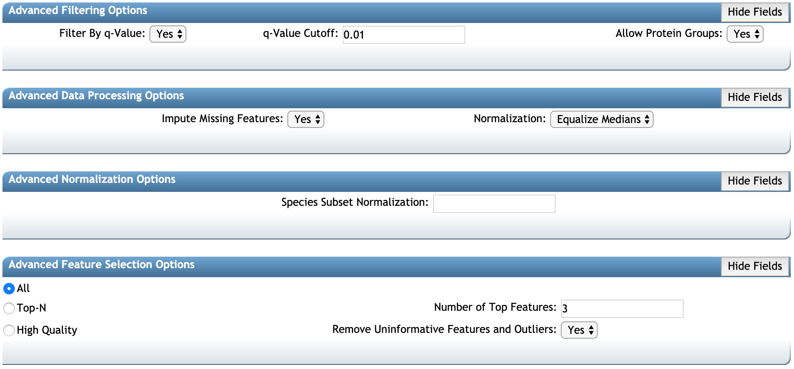
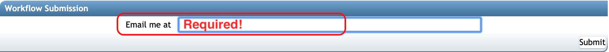

Once your files are fully uploaded to your user account directory at MassIVE or you know which MSV or RMSV has quantification file you want to reanalyze, you are ready to run **MSstats workflow** in MassIVE.quant.

### 2.1 Workflow Selection

First, go to the main webpage for [MassIVE](https://massive.ucsd.edu/ProteoSAFe/static/massive.jsp). Click **Submit your data** in the `Submit Data` section. 

It brings you to the workflow input form. Select **MSstats (1.3)* from the drop-down button in the `Workflow`. Then the webpage will be updated as below. You should add the title in the `Title` (at least 30 characters).

### 2.2 File Inputs

You can reanalyze either your new quantification files or published quantification file.

##### 2.2.1 If you have new quantification files:
    
    - Select the name of data processing tool you used from the drop-down button in the `Tool name`.
    - Select files from your user account directory at MassIVE by clicking any of **Select Input Files** buttons:

Next, the file selection pop-up window (below) helps you browses your account to select the files you uploaded. For **MSstats workflow**, `Annotation File` and `Features` are required to have any file.

Let's select `Annotation File` first.

    - Select the file in your account: *'Choi2017_DDA_MaxQuant_annotationt.csv'* is the annotation file for this experiment. Select (or click) the file name. Then file name will be highlighted.
    - Select category: at the top-left corner, there are boxes for categories. Select (or Click) the box named `Annotation File`.
    - Then, on the right panel, named `Selected Files`, you can see the selected file under the folder named `Selected Annotation File`.

Please repeat for quantification file. Most data processing tools report one feature-leve quantified data, which is required for MSstats. It should be selected for `Feature` category. For `MaxQunat` output, MSstats requires two quantification report, `evidence.txt` for `Features` and `proteinGroups.txt` for `Proteins`. Please repeat to select those two files in the corresponding category.

Once you've selected valid annotation and quantificationi files in the proper categories, click **Fihish Selection** button.

Select the data processing tool name from the drop-down button. Here, `MaxQuant` is selected.

##### 2.2.2 If you want to reqnalyze the published quantification files,

select files

file selection pop-up
**_need capture_**

### 2.3 Comparison Setup
Next, you need to set up the comparison(s) between conditions of interest, **MSstats workflow** provides four options to select comparions. You should choose one of them.

1. All vs. All: This option will generate all pairwise comparisons between conditions in the annotation file. If there are four conditions in the annotation files (Condition1, Condition2, Condition3, Condition4), total six pairwise comparisons will be considered in MSstats : _Condition1-Condition2, Condition1-Condition3, Condition1-Condition4, Condition2-Condition3, Condition2-Condition4, Condition3-Condition4_.

2. One vs. All: This option will generate all pairwise comparisons between one selected condition (base condition) and other conditions in the annotation file. You should select the base condition from the drop-down button, next to `One vs. All` option. If there are four conditions in the annotation files (Condition1, Condition2, Condition3, Condition4) and you select _Condition1_ for the base condition, total three pairwise comparisons will be considered in MSstats : _Condition2-Condition1, Condition3-Condition1, Condition4-Condition1_.

3. Choose Pairs: This option will allow you to select any pairwise comparison you want. If you select `Choose Pairs` option, the list of condition will be shown. Select one condition per each panel and then select `Add Selected Condition Pair` button. Then the comparison(s) you selected will be shown in the box below.

4. Contrast Matrix: If you have the complex linear combination between conditions, you can make your own contrast matrix and use it. The table for contrast matrix can be saved as txt file. It should be uploaded in your account directory at MassIVE.

### 2.4 Advanced options

There are advanced options for options available. This step is optional. The detailed information about all options is available in [msstats.org](http://msstats.org/msstats-2/).

1. Advanced Filtering Options:

2. Advanced Data Processing Options:

3. Advanced Normalization Options:

4. Advanced Feature Selection Options:

advanced option box : the partial options for MSstat. link to the msstats.org
**_need capture_**

### 2.5 Workflow Submission section

Finally, you are ready to submit. Please type your email to get progress notice and click **Submit** button.

Then, you will move to the new page, which shows the progress. Please wait. It will take a few minutes. After the job is done, you will get the notification email.

