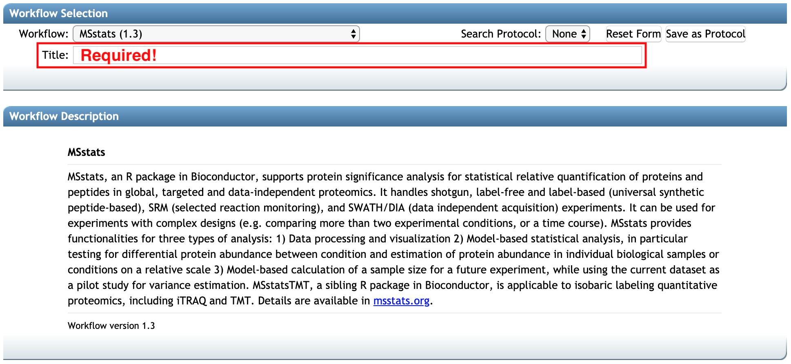

### 1. Upload Data

### 

### 2.1 Workflow Selection

select MSstats (1.3) workflow

select tool type

select files

file selection pop-up
**_need capture_**

contrast matrix

all vs all

advanced option box : the partial options for MSstat. link to the msstats.org
**_need capture_**

**Add Reanalysis** button brings you to a MassIVE reanalysis attachment workflow input form.
At this point, the option **'MassIVE Dataset: Add Reanalysis Results'** should be automatically selected in `Workflow`. Information regarding `Species`, `Instrument`, `Post-Translation Modifications` should also be filled automatically, based on the original submission. You should add 

1. the title in `Title` (at least 30 characters)
2. the description for this reanalysis in `Description` (at least 50 characters)

