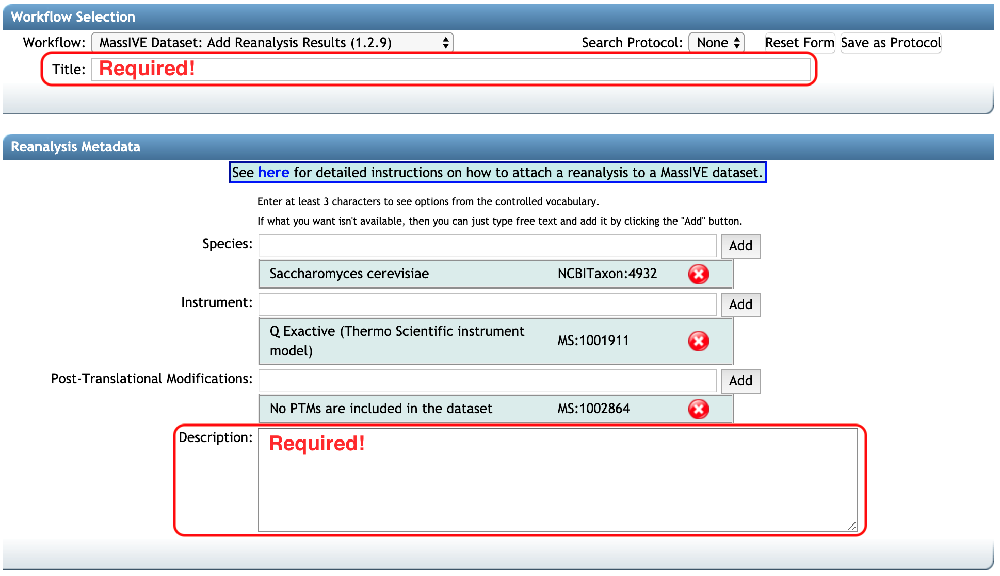

### Add the job done as a reanalysis

go to the dataset

add reanalysis

**Add Reanalysis** button brings you to a MassIVE reanalysis attachment workflow input form.
At this point, the option **'MassIVE Dataset: Add Reanalysis Results'** should be automatically selected in `Workflow`. Information regarding `Species`, `Instrument`, `Post-Translation Modifications` should also be filled automatically, based on the original submission. You should add 

1. the title in `Title` (at least 30 characters)
2. the description for this reanalysis in `Description` (at least 50 characters)

reanalysis file selection -> select input files from massive workflow result

can see the job done in  your account.

select the files for the correct category.