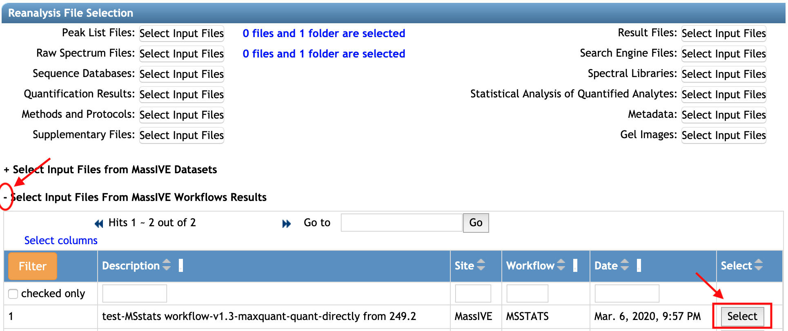
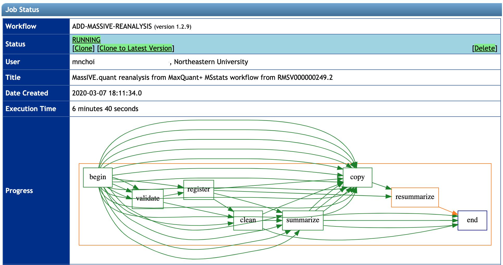

Once the job for **MSstats work** is done, you can submit this result by MSstats as a reanalysis in the MassIVE.quant. It is similar as [Submit Quant Reanalysis](1_submit_quant_2_add_reanalysis.md), *except that you can import the result of MSstats from the finished job*.

### 3.1 Select Dataset

First, go to the webpage for the dataset you reanalyzed. You can search dataset MSV ID or PXD ID in [dataset's web page](../access_public_datasets.md#MassIVEDatasetBrowsing-ViewingaDataset). 

Click the **Add Reanalysis** button:

### 3.2 Workflow Selection and Reanalysis Metadata Sections

**Add Reanalysis** button brings you to a MassIVE reanalysis attachment workflow input form.
At this point, the option **'MassIVE Dataset: Add Reanalysis Results'** should be automatically selected in the `Workflow`. Information regarding `Species`, `Instrument`, `Post-Translation Modifications` should also be filled automatically, based on the original submission. You should add 

1. the title in `Title` (at least 30 characters)
2. the description for this reanalysis in `Description` (at least 50 characters)

Example of a `Title`: 'MassIVE.quant reanalysis from MaxQuant+ MSstats workflow from RMSV000000249.2'

Example of a `Description`: 'MassIVE.quant reanalysis of data from the iPRG2015 study (dataset MSV000079843) using Andromeda for identification and MaxQuant for quantification(from RMSV000000249.2), followed by MSstats for statistical analysis of differentially abundant proteins. Here MSstats(1.3) workflow was used.'

### 3.3 Reanalysis File Selection section 

You should select all files for your reanalysis in this section. Please go through both 3.3.1 and 3.3.2 below.

#### 3.3.1 New files generated by MSstats workflow

**MSstats workflow** generates 

- csv file for the result of differential abundance analysis from MSstats
- R script that is used for MSstats, based on your selection of options in the **MSstats workflow**
- log file that is generated by MSstats, which records the version of R, MSstats, and parameters

You can select all three of them. 

1. Click '**+**' sign in front of **Select Input Files from MassIVE Workflows Results** option. Then the job with the title that you wrote in the **MSstats workflow** will be shown.
2. Click the `Select` button at the very right of this row.

Then, the new pop-up window, `File Selection`, shows all files generated by MSstats. Let's select the file for the result of statistical analysis, first.

1. Find the csv file suffixed **differential_abundance_analysis**. For this example, the second row is for for the result of statistical analysis.
2. Select **Statistical Analysis of Quantified Analytes** from the drop-down button in the `Select` column.
3. Click the `Add` button at the very right in that row.

Repeat the same steps for other three files.

- **script.r** and **msstats.log** should be in **Methods and Protocols**.
- **summary_of_differentially_abundant_proteins.csv** can be in **Statistical Analysis of Quantified Analytes**.

Finally, click `Close` button at the bottom-right on the pop-up window. 

#### 3.3.2 Quant files and Metadata used for MSstats workflows

Next, you should select all quantification file(s) used for **MSstats workflow**. This step is exactly the same as for **MSstats workflow**. Please repeat the same steps that you did for **MSstats workflow**. (The section 2.2. File Inputs in [Step2-MSstats Workflow](3_msstats_workflow_2_run.md))

### 3.4 Reanalysis Container Selection section

The reanalysis attachment workflow will determine which source datasets were reanalyzed, and will then prepare what's referred to as a "reanalysis container" for your attachment. A reanalysis container simply refers to the unique set of datasets that were reanalyzed - usually only one, but possibly more. The workflow then attaches your results to this container. Any other reanalysis results attached (by any user) to this same set of datasets will also go in the same container.

For example, `Reanalysis Container` shows all containers for the source dataset. You can choose one of them or make *New reanalysis container*. If you select **New reanalysis container**, then you should put the title for this container in `Reanalysis Container Title`.

### 3.5 Workflow Submission section

Finally, you are ready to submit. Please type your email to get progress notice and click **Submit** button.

Then, you will move to the new page, which shows the progress. Please wait. It will take a few minutes. 

After the job is done, the status will say 'DONE' and you will get the notification email.

Now this reanalysis is submitted and available under the dataset (For this example, MSV000798430). New RMSV ID is assigned for this analysis, RMSV00000000248.34. You can access all files (Please check [Access Quant Reanalysis](2_access_quant_3_reanalysis.md))

