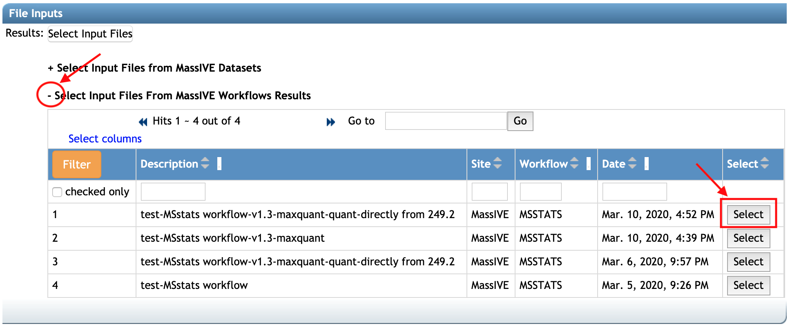
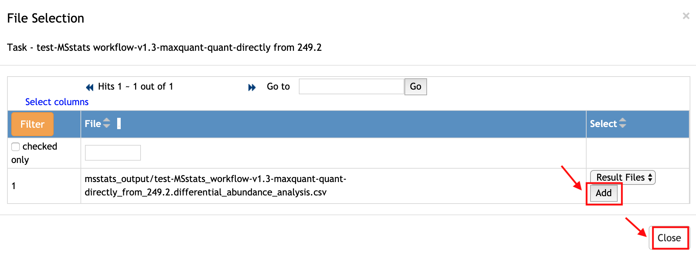
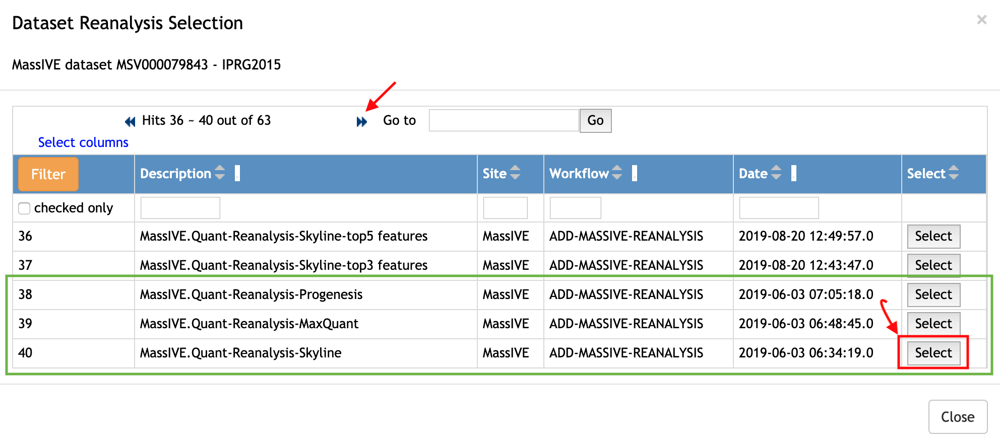
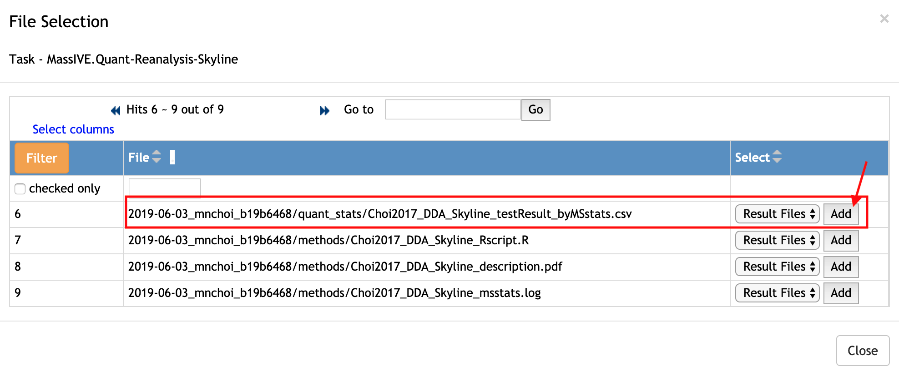
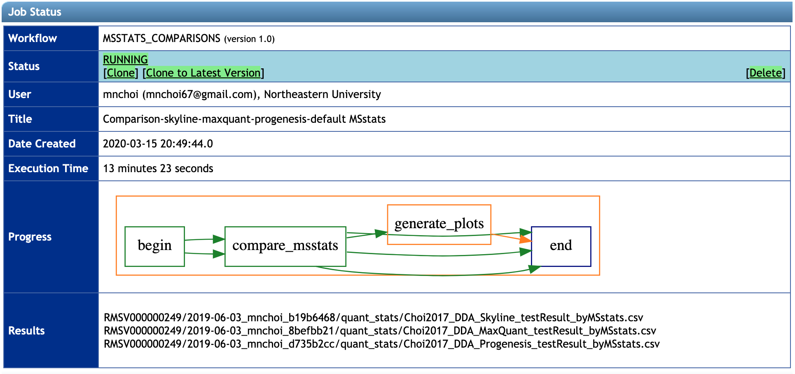
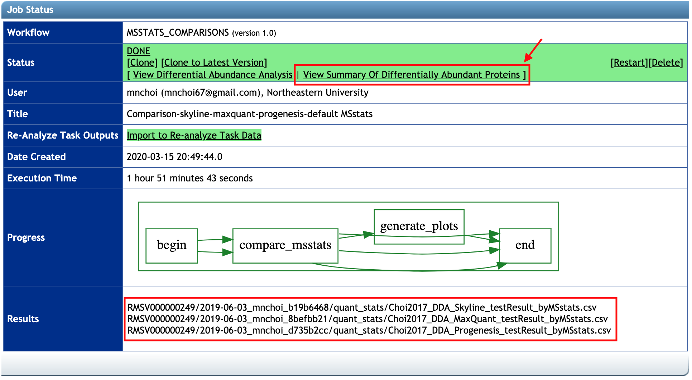
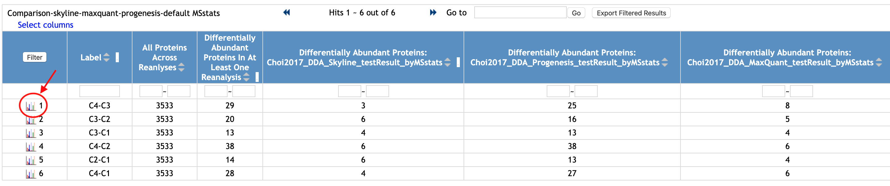
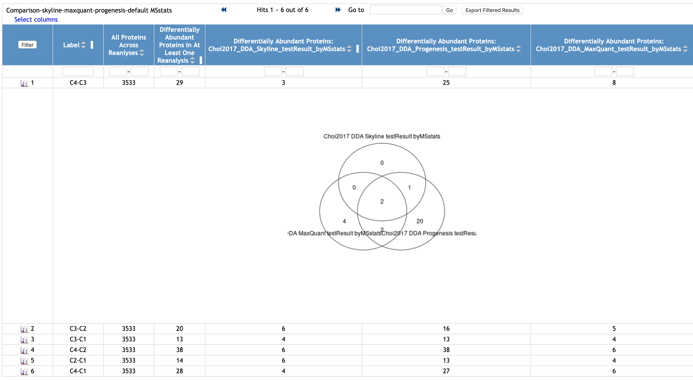

Once you have or know more than two results by MSstats, you can compare the results from MSstats, using **MSstats Comparisons** in MassIVE.quant.

### 1. Workflow Selection

First, go to the main webpage for [MassIVE](https://massive.ucsd.edu/ProteoSAFe/static/massive.jsp). Click **Submit your data** in the `Submit Data` section. 

It brings you to the workflow input form. Select **MSstats Comparisons** from the drop-down button in the `Workflow`. Then the webpage will be changed as below. You should add the title in the `Title` (at least 30 characters).

### 2. File Inputs

You can compare between/across either your MSstats result(s) or published result(s) by MSstats, up to xx MSstats results(Ben, please clarify here.)

#### 2.1 New result(s) generated by MSstats workflow

If you run **MSstats workflow** and haven't submit it as a reanalysis, you can select the result file(s) from the list of jobs done in your account.

1. Click '**+**' sign in front of **Select Input Files from MassIVE Workflows Results** option. Then, the jobs, that you ran and were done successfully, will be shown.
2. Click the `Select` button at the very right of the row that you are interested in.

Then, the new pop-up window, `File Selection`, shows all files generated by MSstats and are available in **Statistical Analysis of Quantified Analytes** category. Let's select the file for the result of statistical analysis, first:

1. Find the CSV file suffixed **differential_abundance_analysis**. For this example, only one file for the result of statistical analysis is available.
2. Select **Result Files** from the drop-down button in the `Select` column.
3. Click the `Add` button in the same cell.

Finally, click the `Close` button at the bottom-right on the pop-up window. 

#### 2.2 Published result(s) generated by MSstats

If you know which published result(s) by MSstats you would like to compare, here are the steps that you can select the files:

1. Click '**+**' sign in front of **Select Input Files from MassIVE dataset** option. Then, the list of dataset will be shown.
2. Type MSV ID in the empty box in the first row and below the column named 'Dataset', for example, 'MSV000079843'
3. Click the `Filter` button at the top left of the table. Then, the row with MSV ID your typed for the `Dataset` column is shown. 
4. Click the `Reanalyses` button at the very right.

Then, the `Dataset Reanalysis Selection` pop-up window helps you select the result files. Find the reanalysis that you are interested in comparing. If there are more than 5 reanalyses in the datasets, please use a double arrow (<< or >>) to see more reanalyses. For example, we are interested in comparing three results in the green box below. We should select them one-by-one. Let's start for row 40. Click the `Select` button at the very right in the row for the reanalysis you want.

Then, the new pop-up window, `File Selection`, shows all files in this reanalysis. Let's select the result files from MSstats.

1. Find the result file by MSstats. For this example, _Choi2017_DDA_Skyline_testResult_byMSstats.csv_ is the result file by MSstats that we want to compare. 
2. Select **Result Files** from the drop-down button in the `Select` column.
3. Click the `Add` button at the very right.

Next, click the `Close` button at the bottom-right on the pop-up window. 

Repeat the same steps for row 38 and 39. Then, you can see three files are selected in total.

### 3. Workflow Submission section

Finally, you are ready to submit. Please type your email to get notice of the progress of the submission and click the **Submit** button.

Then, you will be redirected to a new page, which shows the progress. Please wait. It will take a few minutes. 

After the job is done, the status will say 'DONE' and you will get the notification email.

### 4. Workflow Submission section

After the job is done, you can see the summary of differentially abundant proteins for each analysis.
**Results** row shows the list of results you selected for **MSstats Comparison** workflow.

Click **View Summary Of Differentially Abundant Proteins** in the **Status** row.

The table is the summarization for each comparison (for example, C4-C3) across the selected results.

Click the ion at the left of row number, in the first column. Then the Venn Diagram among differentially abundant proteins will be appeared.

