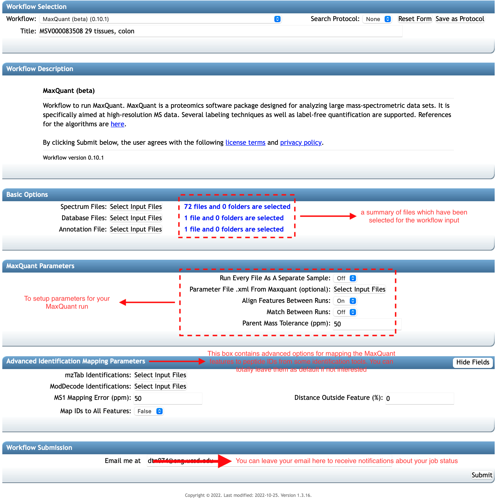

Once your spectrum and annotation files are added, you are ready to run the **MaxQuant workflow**.
The numbers of input files which you have selected are summarized in the **Basic Options** box.
Note that you can add and remove files for the input anytime before you submit the workflow.

### 2.1 MaxQuant Parameters
This workflow supports inputting the most important and likely-to-change parameters when running MaxQuant software. 
These parameters are placed in the **MaxQuant Parameters** box shown in the figure above. 
It also supports uploading a parameter file if you prefer to upload your own parameter file. 
The parameter file should be an .xml file and is typically obtained by **Save parameters** option from your personal MaxQuant software or from some existing MaxQuant run.
An example parameter file with basic parameter setups can be found [here](https://drive.google.com/file/d/1Iiuk1XbXQZW8IuOM3-b73argwVyF-oFA/view?usp=share_link).
You can further edit yours on a local computer and upload it to the workflow by the option of **Parameter File .xml From Maxquant (optional)**.
Once you upload your parameter file, the workflow will automatically parse it and set the corresponding parameter values for the MaxQuant job.
And it should be noted that parameter values in the uploaded file have higher priority over ones set in the workflow view, e.g,
if one parameter is set in both the uploaded file and some workflow input field, the final value would be as in the parameter file. 

The workflow also includes other important parameters in the same **MaxQuant Parameters** box so that you can easily setup and start your workflow run.
If you want to consider each file as generated by a separate experiment/sample, you can turn on the option of **Run Every File As A Separate Sample**.
This can be helpful when you want that MaxQuant outputs result separately for each file, and does not perform tasks such as alignment, normalization between input files.
You can also select different values in the options **Align Features Between Runs** and **Match Between Runs** if you prefer.
More details on the two options can be found in [the MaxQuant tutorial](https://pharmazie.uni-greifswald.de/storages/uni-greifswald/fakultaet/mnf/pharma/biotechno/dokumente/MaxQuant_Infos_and_Tutorial_07.pdf).
The last parameter **Parent Mass Tolerance (ppm)** on the box is to setup the precursor or parent mass tolerance - it should be a number in ppm.

### 2.1 Advanced Identification Mapping Parameters

The box of **Advanced Identification Mapping Parameters** in the following figure supports settings for mapping features from MaxQuant to peptide sequences identified by database search tools.
It should be noted that if you purely want to run and get quantitative result from MaxQuant software as usual, do not mind! This section is not for your need. 
MaxQuant uses an integrated tool, [Andromeda](http://www.coxdocs.org/doku.php?id=maxquant:andromeda) for peptide identification.
However, our **MaxQuant workflow** gives you a flexible option that you use identification results from other tools to map to the feature.
The workflow version 0.10.1 has supported two independent identification tools [MS-GF+](https://www.nature.com/articles/ncomms6277) and [ModDecode]().

The identification mapping is after the MaxQuant's feature detection, 
it would match the features to MS2 spectra based on the reported retention times and the theoretical m/z of the peptides identified.
For using the mapping, you first need to have MS-GF+ or ModDecode's identification output file on MassIVE repository.
Next, using `mzTab Identifications` and/or `ModDecode Identifications` options to navigate to the directories of the files on MassIVE,
then select and add them into the workflow input. This process is similar to what you did to add spectrum and annotation files to the workflow.
You can also refer the following figure as a graphical guideline for this task.
The parameter of `MS1 Mapping Error (ppm)`, which is for the mapping tolerance between the measured and theoretical m/z (in ppm) is set as 50 by default.
You can change to a lower (or higher) value if prefer a stricter (or looser) mapping in terms of the m/z difference.