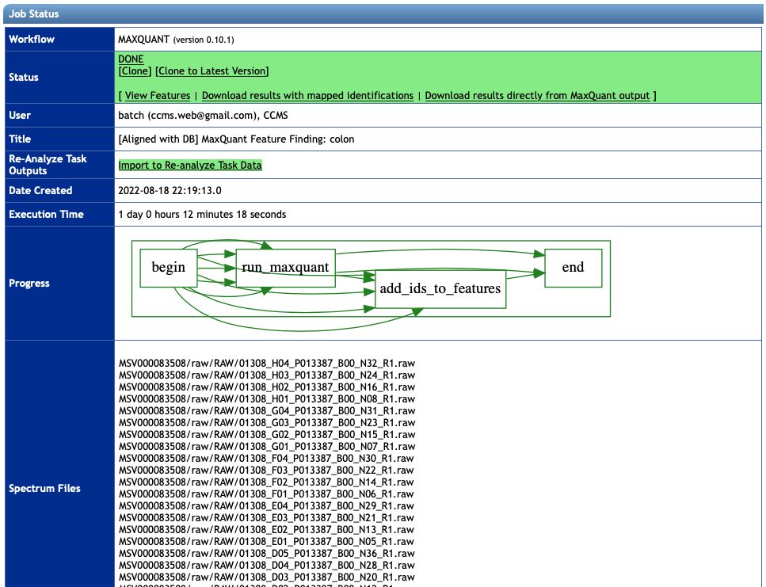

After the job is done, you will see a summary webpage similar as in the following figure.
The result files would be found in the `Status` section.
In addition, you can see information about the workflow run from the other sections, such as input files used, the job status, running time and its computation graph, etc.

### 3.1 View Features and Download MaxQuant Result Files

Once you select `View Features` button in the `Status` section, the workflow will provide a list of features detected and mapped to [Andromeda's](http://www.coxdocs.org/doku.php?id=maxquant:andromeda) peptide IDs by MaxQuant software.
This result is basically from the text file `evidence.txt` that you could find in the directory `/combined/txt` if running MaxQuant locally.
If you are interested in a complete set of MaxQuant result files including `allPeptides.txt`, `evidence.txt`, `peptides.txt`, `proteinGroups.txt`, etc.,
please use the button `Download results directly from MaxQuant output` in the same section.
The description of these files can be found in [the MaxQuant tutorial](https://pharmazie.uni-greifswald.de/storages/uni-greifswald/fakultaet/mnf/pharma/biotechno/dokumente/MaxQuant_Infos_and_Tutorial_07.pdf).

### 3.2 Download Result Files by Our Advanced Mapping

If you provided peptide IDs in the section `Advanced Identification Mapping Parameters` before starting your workflow,
you can find the results with the mapped IDs by the option `Download results with mapped identifications` in the `Status` section.
The information of mapped features, peptides and proteins is stored in .tsv files in the downloaded folder `mapped_features`.
The file `evidence.tsv` would be the most important file among them. This probably contains all information needed for your further analyses.
Our mapping also outputs `evidence.tsv` and `proteins.tsv` as the same formats with MaxQuant's `evidence.txt` and `proteinGroups.txt`, respectively.
Thus, you can easily read our mapping and MaxQuant's result files in the same way.