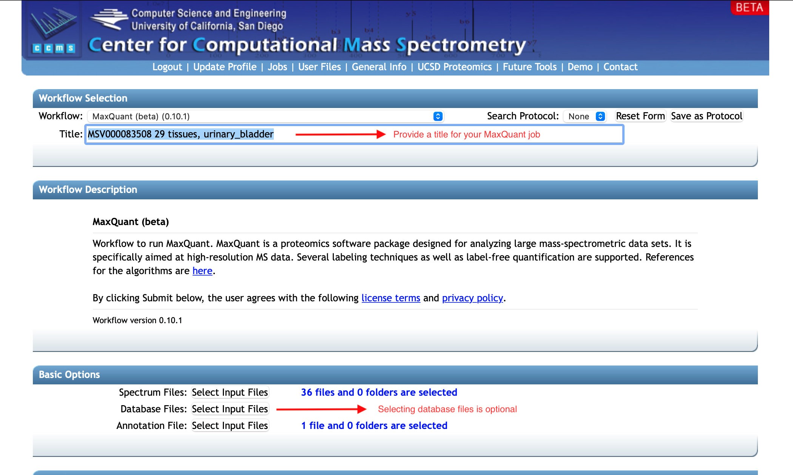
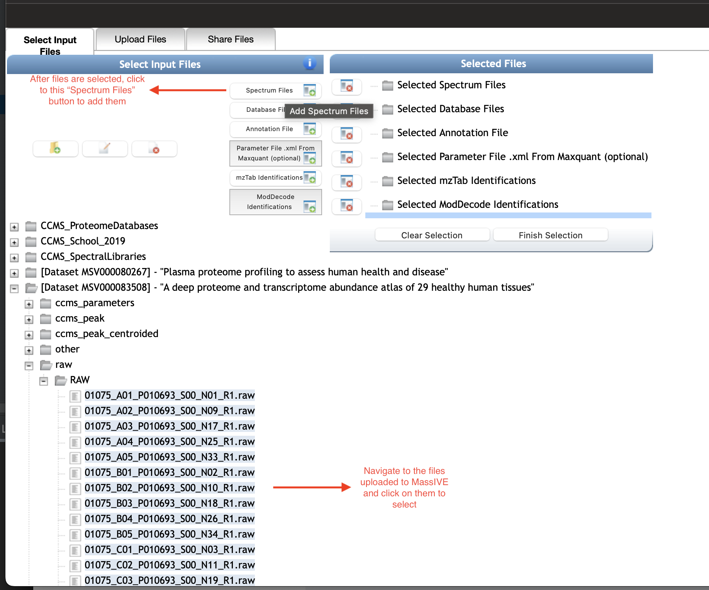
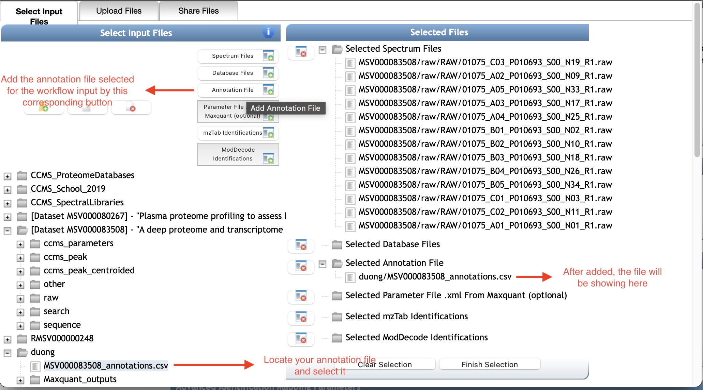

The **MaxQuant workflow** is designed to run MaxQuant Software, a quantitative proteomics package on web server environment. 
That would help your MaxQuant using become convenient and efficient.
We also support a friendly user-interface for reporting results and editing parameters on this workflow.
And, a new component - mapping features from MaxQuant to peptide sequences identified by the most effective database search tools such as MS-GF+, ModDecode.

To run the **MaxQuant workflow**, a set of spectrum files together with an annotation file is needed. The other inputs are not strictly required and will be explained later in this document.

### 1.1 Workflow Overview
You can perform **MaxQuant workflow** for running the software package in our web server. It would contain every result, output files gained if running on your local.

The main interface of the workflow is as the following.

The first step would be uploading your input files to the workflow (including spectrum files and an annotation file for the set of spectra).
The **Basic Options** box includes upload buttons for the main input.
Note that you can use databases to perform the Maxquant search on sequences of the specific species but are not required to upload database files.
It is helpful in terms of both search quality and time, since you know which species your samples come from.
When running without a database, Maxquant will perform the search with common contaminants (under the software's folder MaxQuant/bin/conf/contaminants.fasta or in [this link](https://lotus1.gwdg.de/mpg/mmbc/maxquant_input.nsf/7994124a4298328fc125748d0048fee2/$FILE/contaminants.fasta)). 

### 1.2 Step 1.1: Upload Data

If you have a new dataset, start by uploading your spectrum and annotation files to your MassIVE account.

Uploading data for MassIVE repository submission is the general procedure for any data submission in MassIVE repository.
Please follow the instruction on [how to upload data for MassIVE repository](https://ccms-ucsd.github.io/MassIVEDocumentation/submit_data/).

### 1.2 Step 1.2: Input Files

After your desired spectrum files are in MassIVE repository - either they already exist or you uploaded them yourself.
You can select and add them for the input of the workflow as in the following figure.
Note that you can select multiple files at a time or select all files in a folder just by select that folder (see details on  **MassIVE** section).

Similarly, locate to your annotation file in MassIVE, then select and add it by the corresponding button **Annotation File**.

The other input files are optional in this workflow, but if you want to use them the way to add is similar to what we went through for the spectrum and annotation files.

Since necessary files were added to the workflow input, you can move on to **Step 2: Parameter setup**.