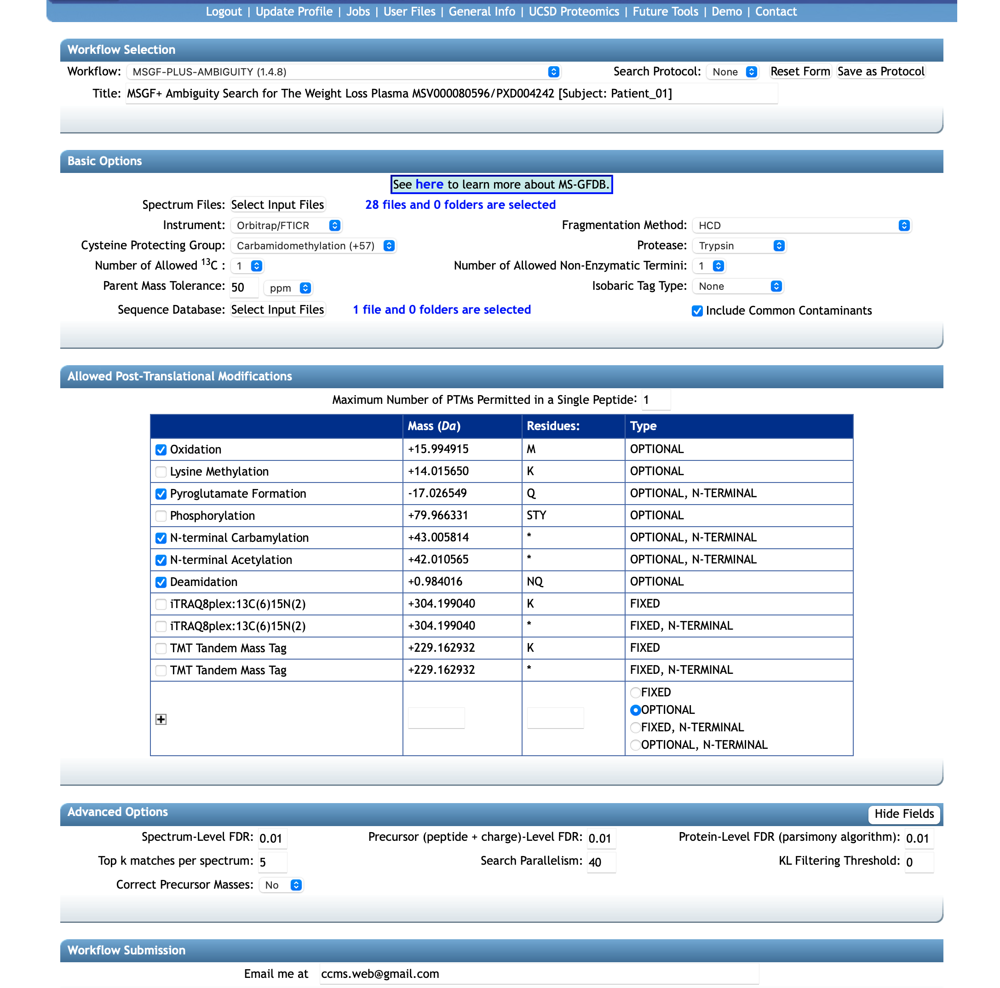
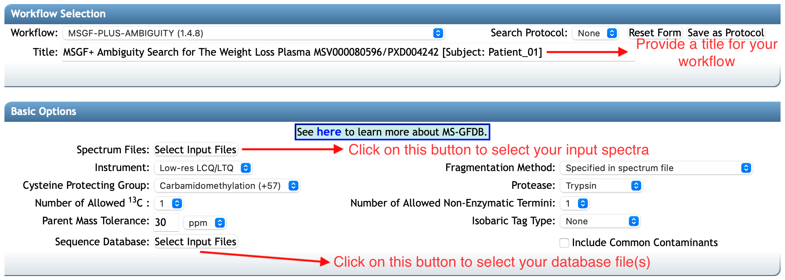
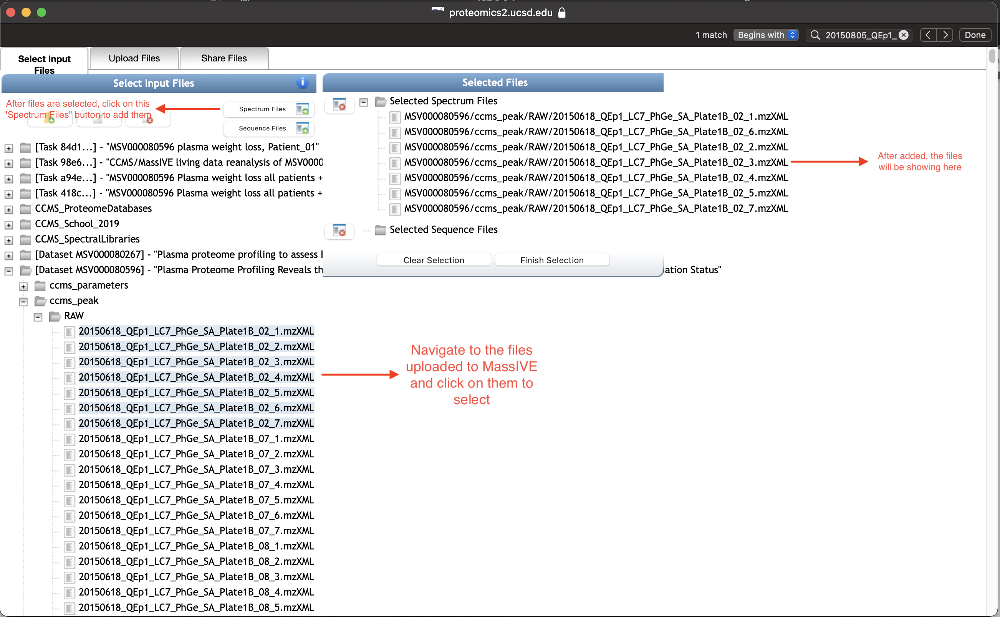
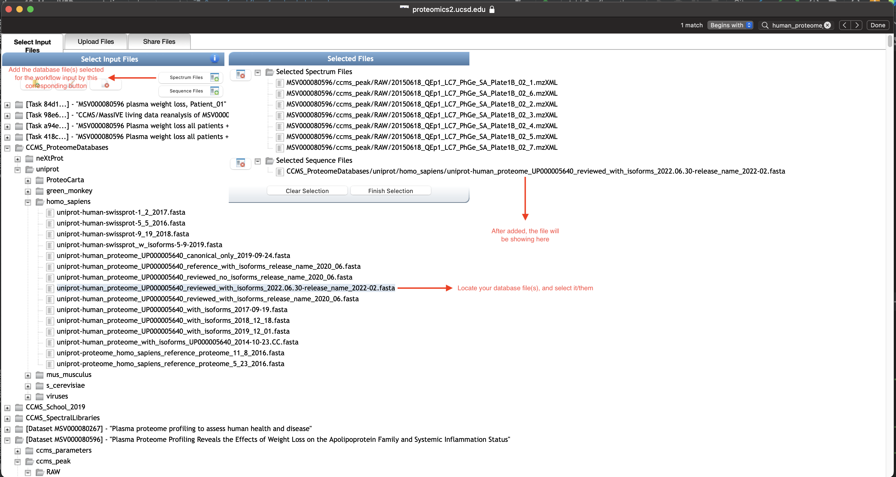

The **MS-GF+ Ambiguity** is an improved implementation for [MS-GF+](https://www.nature.com/articles/ncomms6277), 
regraded as one of the most effective database search tools for MS/MS data.  
Our **MS-GF+ Ambiguity** implementation is deployed on web server environment to be convenient and resource-efficient for the users.
We also support a friendly user-interface to support the users set up and edit parameters easily.
The users can also view and download results directly from the workflow.
And, many new components are developing and will be integrated into the workflow.

To run the **MS-GF+ Ambiguity** workflow, a set of spectrum files together with a protein database file (e.g. `*.fasta, *.fa, *.faa`,..) is needed.
The parameter settings will be described later in the section **setup parameters** of this document.

### 1.1 Workflow Overview
You can have an **MS-GF+ Ambiguity** workflow by either starting a new one from our [ProteoSAFe website](https://proteomics2.ucsd.edu/ProteoSAFe/index.jsp) or cloning an existing workflow.

The main interface of the workflow is as the following figure and includes main sections: `Workflow Selection` for specifying the title for your workflow;
`Basic Options` - this is the most needed section, for uploading input files and setting up basic parameters for your workflow;
`Allowed Post-Translational Modifications` for specifying the number of PTMs (Post-Translational Modifications) and the specific PTMs that you are interested in the mass spectrometry data;
`Advanced Options`, as the name it is for setting up advanced options related to the search's quality and performance.
We would recommend you let them as default if you are not familiar with them.
`Workflow Submission` for inputting for email address to receive notifications when your workflow is running.

The first step would be selecting or uploading your input files to the workflow (including spectrum files and a database file).
The **Basic Options** box includes upload buttons for the main input.
Note that it is helpful in terms of both search quality and time, since you know which species your samples come from to determine an appropriate database file.
The workflow also supports searching on common protein contaminants, such as `trypsin (TRYP_PIG, TRYP_BOVIN)`, `keratin (K22E_HUMAN, K22O_HUMAN, K2C1_HUMAN, K2C3_HUMAN, K2C7_HUMAN, K1C1_HUMAN)`,..
But we will do to the details later in the section **setup parameters**.

### 1.2 Step 1.1: Upload Data

If you have a new dataset, start by uploading your spectrum and/or database files to your MassIVE account.

Uploading data for MassIVE repository submission is the general procedure for any data submission in MassIVE repository.
Please follow the instruction on [how to upload data for MassIVE repository](https://ccms-ucsd.github.io/MassIVEDocumentation/submit_data/).

### 1.3 Step 1.2: Input Files for The workflow

After your desired spectrum files are in MassIVE repository - either they already exist or you uploaded them yourself.
You can select and add them for the input of the workflow as in the following figures.
Note that you can select multiple files at a time or select all files in a folder just by select that folder (see details on  the **MassIVE** section in the website menu).

And adding them by the button `Spectrum Files`:

Similarly, locate to your database file(s) in **MassIVE**, then select and add it by the corresponding button `Sequence Files`.
In this example, we use a fasta file of human proteome from [UniProt](https://www.uniprot.org/proteomes/UP000005640), since we are doing a search on spectral data from human.

Since the desired files were added to the workflow input, you can go over and set values for necessary parameters of the **MS-GF+ Ambiguity** search.
We will describe the full set of **MS-GF+ Ambiguity** parameters in the next section, **Step 2: Setup Parameters**.