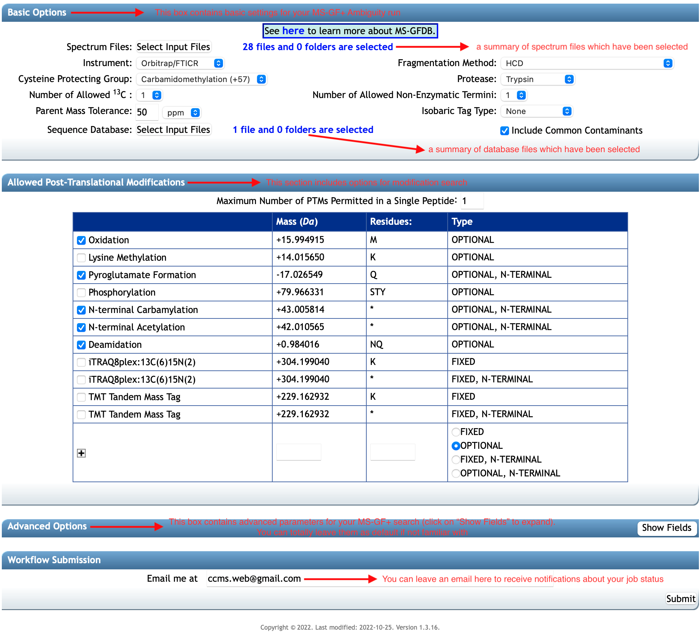
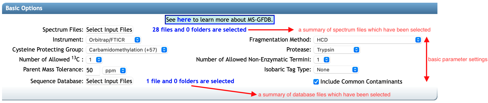
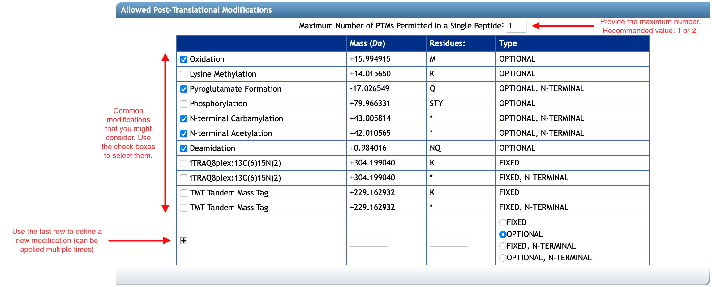
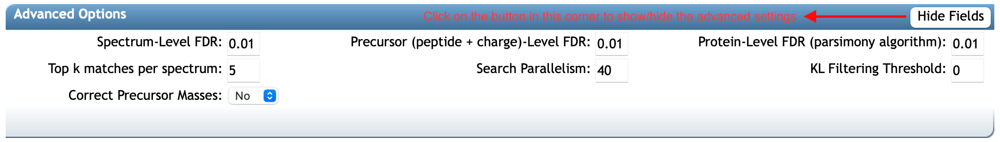

Once your spectrum and database files are added, they will be summarized in the **Basic Options** box.
It should be noted that you can add and remove files for the input anytime before you submit the workflow.
Next, you would like to configure parameters for your **MS-GF+ Ambiguity** search from the workflow's user interface.

### 2.1 Basic Parameters
This workflow supports a convenient interface for inputting the most important and likely-to-change parameters (depend on the mass spectrometry data) for your **MS-GF+ Ambiguity** search. 
These parameter inputs are placed in the `Basic Options` box shown in the figure below.

Specifically:

* `Instrument`: Type of mass spectrometer used to generate the experimental spectra.
* `Fragmentation Method`: Fragmentation method used - this parameter would be used to determine the scoring model.
* `Cysteine Protecting Group`: Chemical modification used to treat the cysteine residues in the peptide (typically, a +57 Carbamidomethylation is used).
* `Protease`: Choice of a proteolytic enzyme (Default: `Trypsin`).
* `Number of Allowed` 13C: Number of Carbon-13 allowed (Default: `1`).
* `Number of Allowed Non-Enzymatic Termini`: Specifying the number of allowed non-enzymatic termini (Default: `1`).
This parameter is used to apply the enzyme cleavage specificity rule when searching the database.
For example, for `Trypsin` with `value = 0`, it will search for fully tryptic peptides only.
Using `value = 1` or `2` can make the search slower.
* `Parent Mass Tolerance`: Precursor mass tolerance in ppm or Da.
It is recommended to use a tight tolerance rather than a loose tolerance (e.g. for Orbitrap data, 10ppm or 20ppm usually identifies more spectra than 50ppm).
* `Isobaric Tag Type`: Isobaric tags used for quantification (Optional).
* `Include Common Contaminants`: If selected, additionally search on a small database of common protein contaminants, such as trypsin (TRYP_PIG, TRYP_BOVIN), keratin (K22E_HUMAN, K22O_HUMAN, K2C1_HUMAN, K2C3_HUMAN, K2C7_HUMAN, K1C1_HUMAN),..

### 2.2 Modification Search Parameters

If you consider modifications for your search, the box of **Allowed Post-Translational Modifications** would support this on all common as well as novel Post-Translational Modifications (PTMs), which you can define by yourself. 
First, you can fill in a number in the head, the `Maximum Number of PTMs Permitted in a Single Peptide`.
Note that if this value is large and multiple dynamic modifications are considered, the search will be slow (depending on size of the `fasta` files).
The recommended value here are 1 or 2 (Default: `1`).

There is a list of common modifications in the table. You can select modifications that you are considering.
The **MS-GF+ Ambiguity** workflow also supports you adding novel or additional PTMs. You can add one after providing the mass (in `Da`) and the residues in the last row.
The residues must be a string of abbreviation letters for standard amino acid (i.e. `ACDEFGHIKLMNOPQRSTUVWY`).
You can also fill in this field with an asterisk `*` if any residue will fit in your experiment.

### 2.3 Advanced Parameters

The box of **Advanced Options** in the following figure supports settings for the quality control and performance of your **MS-GF+ Ambiguity** search.
If you are not interested in customizing your search result and speed, do not mind any parameter in this section and just leave them as default.
Otherwise, please follow the following description for these parameters.

* `Spectrum-Level FDR`: Peptide-Spectrum Match-level (PSM-level) false discovery rate used to filter results (Default: `0.01`, e.g. `1%` FDR).
* `Precursor (peptide + charge)-Level FDR`: Precursor-level false discovery rate used to filter results (Default: `0.01`, e.g. `1%` FDR). 
Note that a precursor is defined as a peptide sequence with a charge state.
* `Protein-Level FDR (parsimony algorithm)`: Protein-level false discovery rate used to filter results (Default: `0.01`, e.g. `1%` FDR).
* `Top k matches per spectrum`: Number of matches per spectrum to be reported (Default: 5).
* `Search Parallelism`: Number of spectrum files to search in parallel. 
This parameter is useful if your spectral dataset is large. Range of 1 to 200 (Default: 40).
* `KL Filtering Threshold`: Spectra with a [Kullback-Leibler (KL) divergence](https://en.wikipedia.org/wiki/Kullback–Leibler_divergence) above this value will be filtered out.
If threshold is set to 0, no spectra are filtered out.
* `Correct Precursor Masses`: Select `Yes` if you want to correct precursor masses during KL filtering.