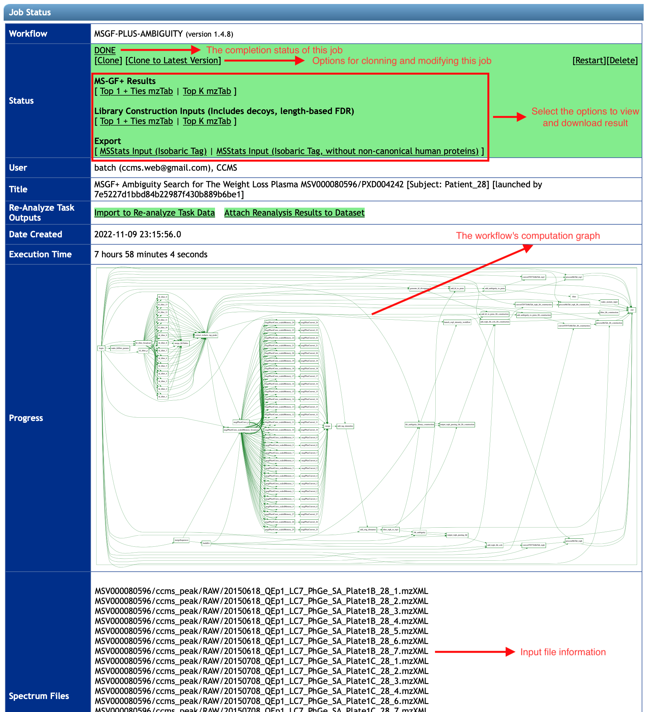
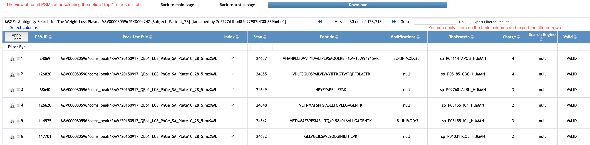
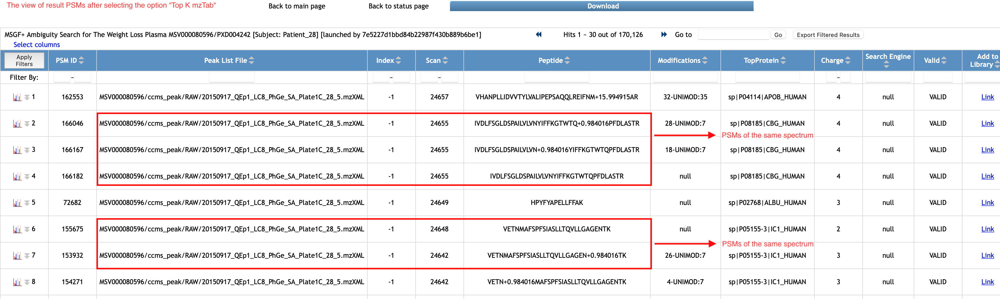

After the job is done, you will see a summary webpage similar as in the following figure.
Different options to view and export the run's result can be found in the `Status` section.
In addition, you can see details about the **MS-GF+ Ambiguity** run from the other sections, such as input files used, the job's status and running time and its computation graph, etc.

In order to view the result Peptide-Spectrum Matches (PSMs), click into options `Top 1 + Ties mzTab`, or `Top K mzTab` under the line `MS-GF+ Results`.
The former option will show you the list of PSMs passing the FDR threshold and allow returning at most one sequence for each input spectrum.
While the later one accept top K matches per spectrum.
The value of K would depend on the parameter `Top k matches per spectrum` on the `Advanced Options` before submitting the job (Please revisit **Step2 - Setup Parameters** to learn how to use the parameter).

Depends on the number of PSMs returned by the search, it would take some time to generate the result view - Typically, it takes a few minutes.
You can see in the following figure an example of our search's result view after `Top 1 + Ties mzTab` is selected.
There are around 129K lines returned, each includes the complete information of the corresponding PSM such as file name and scan number of the spectrum, the peptide sequence and charge state assigned to the spectrum.
The workflow also reports additional information that might be helpful for your further analysis, for example the accession of the protein matched to this spectrum
and the positions and accessions of all Post-Translational Modifications (PTMs) found for this spectrum identification, etc.
You can scroll to the left and right to explore all the result columns.
The meanings of the columns are also shown after you click on the column headers.

Since the option `Top K mzTab` is selected, the view would have more PSMs returned. The following figure has more than 170K PSMs from the same job - in this case K = `5`.
Because multiple sequences (at most K) can be assigned to a spectrum and reported if they pass the FDR threshold.
There are different sequences in the same rectangle that are matched to a spectrum, as shown in this example.

In addition, the workflow also supports processing and exporting your **MS-GF+ Ambiguity** search result to the inputs for the other tasks,
such as for library construction or [MSStats](https://ccms-ucsd.github.io/MassIVEDocumentation/#quant/3_msstats_workflow_1_upload_data/) inputs.
If you are interested, please see the options under sections `Library Construction Inputs (Includes decoys, length-based FDR)` and `Export` of the `Status` box.