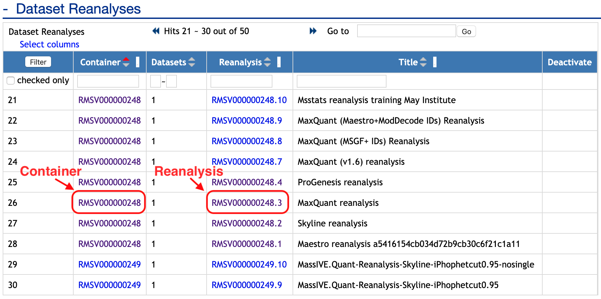
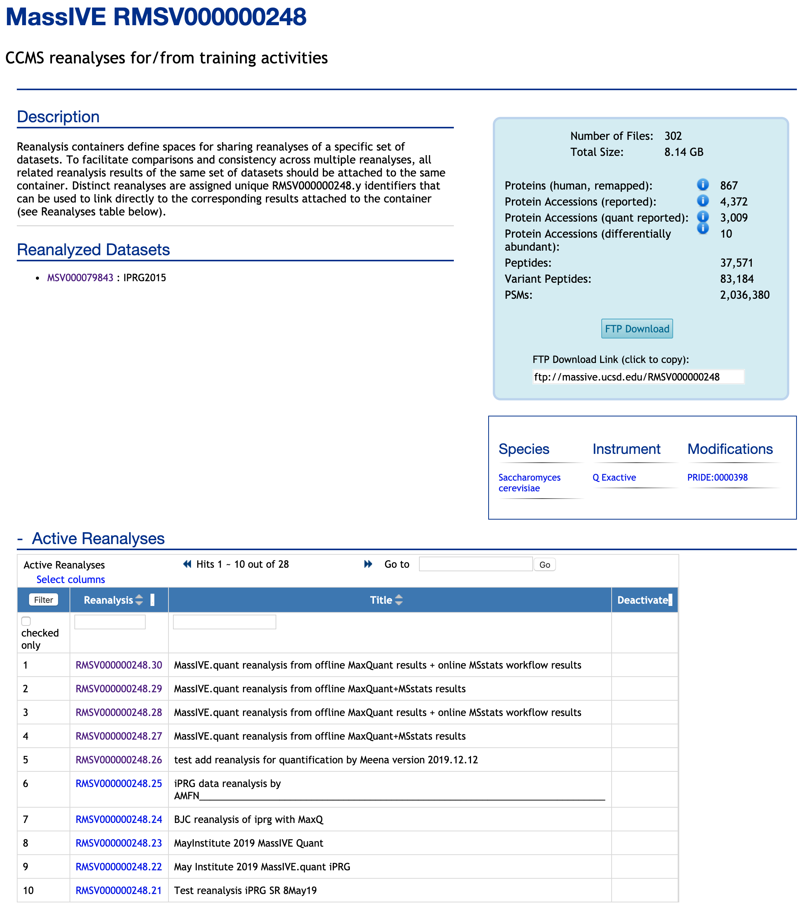
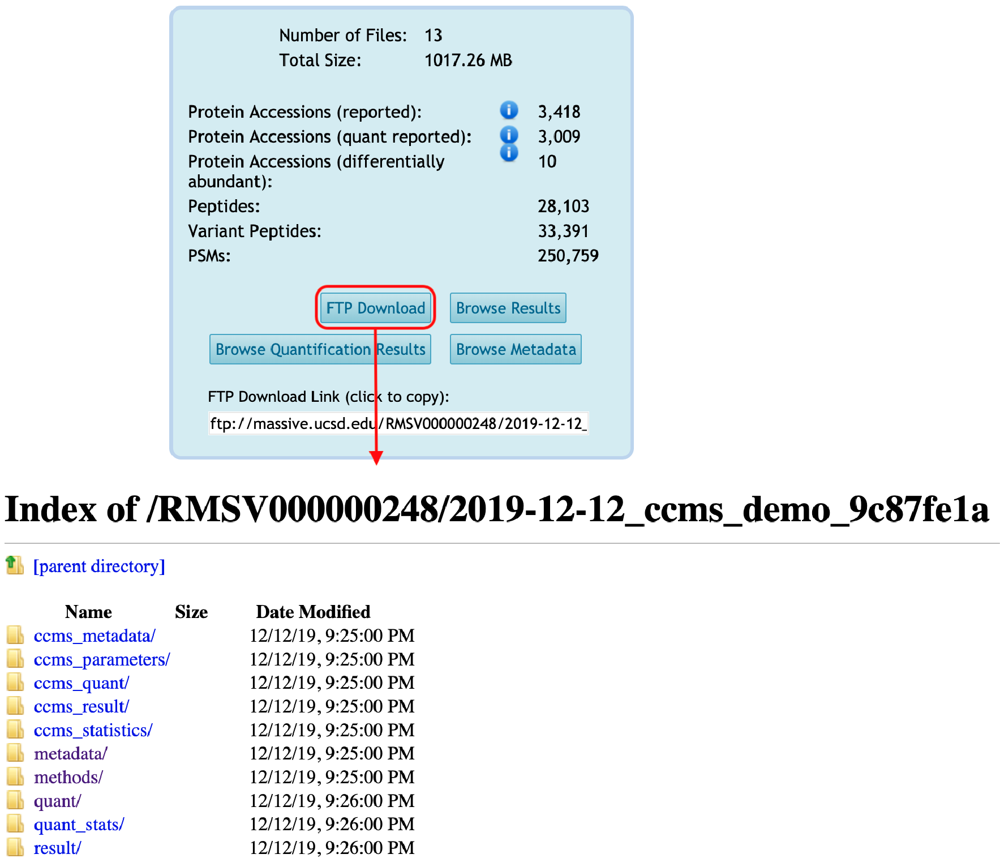
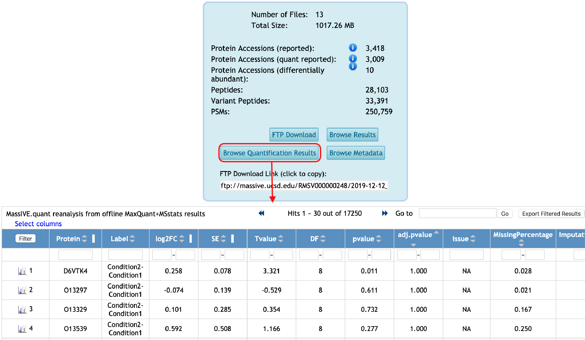

## Step 3: Reanalysis now shows up on the dataset page

Once the attachment job is finished, both the container and the reanalysis will now show up on the dataset page:

#### Container view
As well as on the page for the container itself (which is always accessible from the dataset):

#### Reanalysis view
Each individual reanalysis has its own page, as well (accessible from either the dataset or the container):

#### Reanalysis files are available for downloading from FTP space
And the reanalysis files will be available for download from the container's FTP space:

#### Browse reanalysis files
You can browse the quantification results for your reanalysis by clicking on "Browse Quantification Results" from the reanalysis page:

Also, you can browse the metadata for your reanalysis by clicking on "Browse Metadata" from the reanalysis page:

