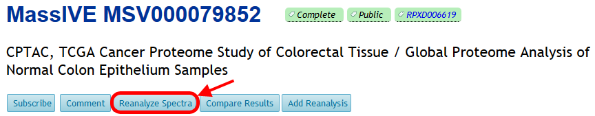
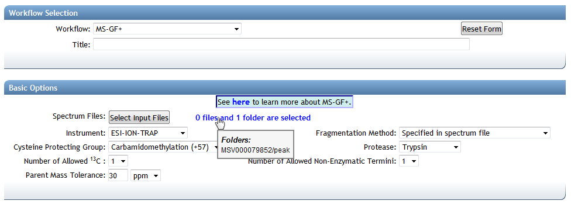

Start reanalyzing MassIVE datasets by clicking the “Reanalyze Spectra” button on the dataset page:

This brings you to the ProteoSAFe data analysis workflow input form, with the dataset’s spectrum files pre-selected. From here you can configure and run your search on these files:

ProteoSAFe offers a variety of analysis tools to derive meaningful knowledge from a dataset’s spectrum files:

| Workflow                        | Link                                                                                               |
| ------------------------------- | -------------------------------------------------------------------------------------------------- |
| Database Search                 | [MS-GF+](http://proteomics.ucsd.edu/ProteoSAFe/index.jsp?params={%22workflow%22:%22MSGF_PLUS%22})  |
| Spectral Library Search         | [MSPLIT](http://proteomics.ucsd.edu/ProteoSAFe/index.jsp?params={%22workflow%22:%22MSPLIT_NEW%22}) |
| Multi-Blind Modification Search | [MODa](http://proteomics.ucsd.edu/ProteoSAFe/index.jsp?params={%22workflow%22:%22MODA%22})         |
| De Novo Peptide Sequencing      | [PepNovo](http://proteomics.ucsd.edu/ProteoSAFe/index.jsp?params={%22workflow%22:%22PEPNOVO%22})   |
| Proteogenomics                  | [Enosi](http://proteomics.ucsd.edu/ProteoSAFe/index.jsp?params={%22workflow%22:%22ENOSIC2%22})     |
| Multi-Pass Search               | [Maestro](http://proteomics.ucsd.edu/ProteoSAFe/index.jsp?params={%22workflow%22:%22MAESTRO%22})   |
