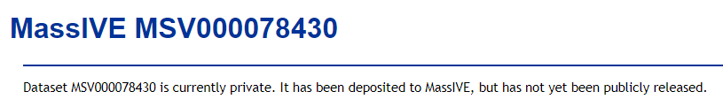

# Reviewer Web Access

When each dataset is initially submitted, it is considered private by default and remains so until its submitter explicitly [makes it public](make_public.md). While the dataset remains private, only its submitter can view its web page and browse its metadata. Any other user, when attempting to load the dataset's web page, will be redirected to a private holding page such as this:

> 

However, dataset submitters can allow trusted colleages to access their private dataset via a special "reviewer" account, which is automatically created for each dataset during submission. This account has special privileges to view the dataset's files and metadata even while the dataset is private. The reviewer account's login credentials are:

Username:	{MSV_accession}_reviewer

Password:	{*dataset*'s password - NOT the submitter's private account password!}

> **Please note that a dataset's password must be set during initial submission by entering it into the "Password" field in the dataset submission form. If this field is left blank, then the dataset will be automatically assigned the anonymous password "a". Please DO NOT share your own private account's password with reviewers. See our [dataset submission documentation](submission_workflow.md#dataset-privacy) for more details on dataset privacy and how to set this password.**

For example, if your dataset was MSV000000001, then the reviewer account username would be "MSV000000001_reviewer", and the password would be the one you entered into the initial dataset submission form, or "a" if you did not enter a password.

With these credentials your reviewers can access your private dataset, and since the dataset’s files are automatically shared with this account it can also be used to run [ProteoSAFe analysis workflows](reanalyze_spectra.md) on those files for testing and review purposes.

# Reviewer FTP Access

Please note that the "_reviewer" username is for web access only. For FTP access, the username should simply be the full MSV accession of the dataset. The password is the same in both cases.

See our [dataset FTP download documentation](download_data.md) for more details.
