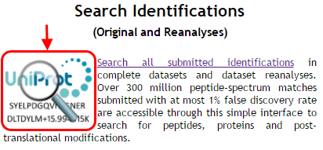
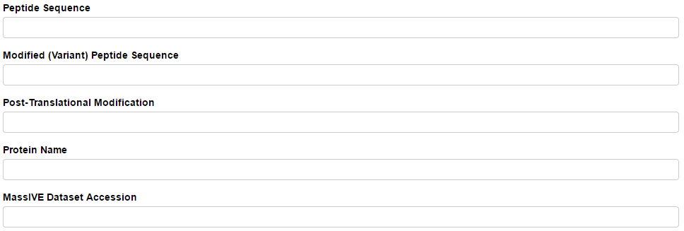
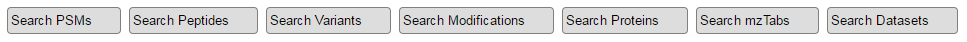
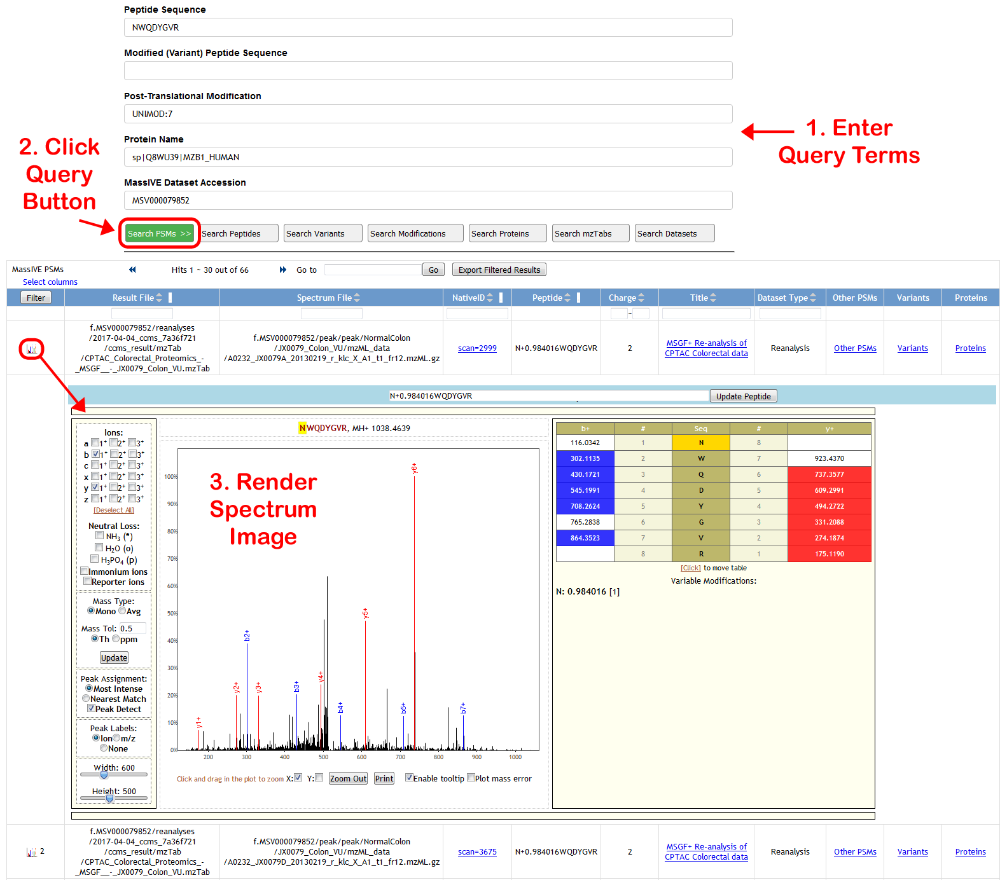

# Search Identifications

Start searching MassIVE identifications by clicking the search icon on the MassIVE home page:

You will then see a search interface with five query fields at the top:

Enter terms into these query fields to refine your search. Or leave them empty to search all of MassIVE.

*   Peptide Sequence – unmodified amino acid sequence of the peptide you wish to search
    *   Example: DDDIAALVVDNGSGMCK
*   Modified (Variant) Peptide Sequence – modified amino acid sequence of the peptide you wish to search
    *   Enter the “+/-” modification masses directly into the sequence
    *   N-terminal modifications should be written before the first amino acid
    *   Example: +42.010565DDDIAALVVDNGSGM+15.994915C+57.021464K
*   Post-Translational Modification – UNIMOD or PSI-MOD accession for the modification you wish to search
    *   Start typing the modification name and a list of matching accessions will appear from which to select
    *   Example: UNIMOD:35 _(Oxidation)_
*   Protein Name – Protein database accession (usually UniProt) of the protein you wish to search
    *   Example: sp|P60709|ACTB_HUMAN
*   MassIVE Dataset Accession – the full 9-digit MSV accession of the MassIVE dataset you wish to search
    *   Example: MSV000079852

The more of these fields you fill out, the more your search results will be narrowed, since all of the terms you enter will be applied simultaneously to the query.

When you are ready to search, click one of the seven query buttons:

*   Search PSMs – find all spectrum identifications matching your query terms
    *   Displays the source files (spectrum data and search result) from which each PSM came
    *   Displays a link back to the submission or reanalysis attachment job for full provenance
    *   Click the spectrum icon  on the left end of each row to render and image of the PSM
*   Search Peptides – find all unmodified peptides from identifications matching your query terms
*   Search Variants – find all modified peptides from identifications matching your query terms
*   Search Modifications – find all post-translational modifications from identifications matching your query terms
*   Search Proteins – find all proteins from identifications matching your query terms
    *   Proteins with the “remapped_” prefix are matched to PSMs without regard to distinctions between amino acids “I” (isoleucine) and “L” (leucine) in the peptide sequence. This is because these amino acids are functionally indistinguishable, so they are treated as identical for the purpose of protein mapping.
*   Search mzTabs – find all submitted result files containing identifications matching your query terms
*   Search Datasets – find all MassIVE datasets containing identifications matching your query terms

Example query: PSMs from dataset [MSV000079852](http://massive.ucsd.edu/ProteoSAFe/dataset.jsp?task=120ab12f58594dd29c5a71de529a9686) (“CPTAC, TCGA Cancer Proteome Study of Colorectal Tissue”) with deamidated (UNIMOD:7) peptide sequence NWQDYGVR matched to protein [sp|Q8WU39|MZB1_HUMAN](http://www.uniprot.org/uniprot/Q8WU39) (“Marginal zone B- and B1-cell-specific protein”)

