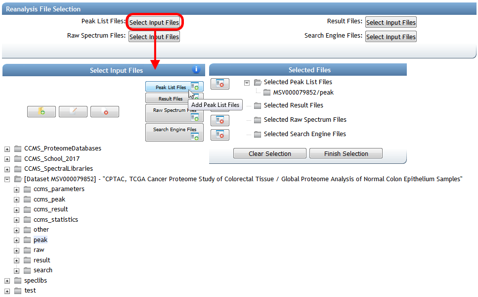
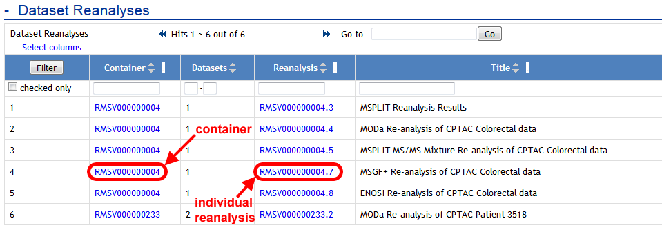
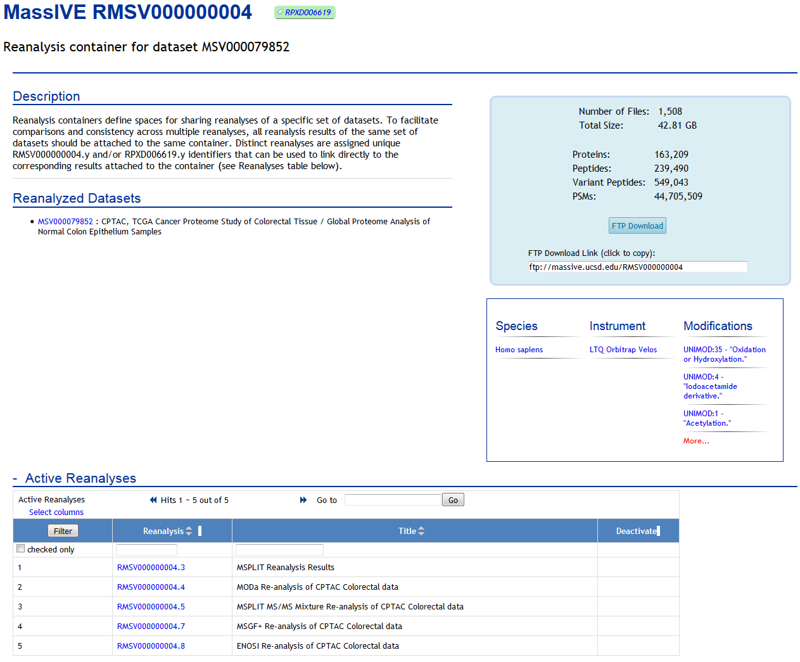
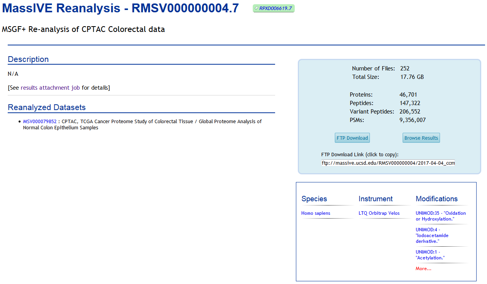
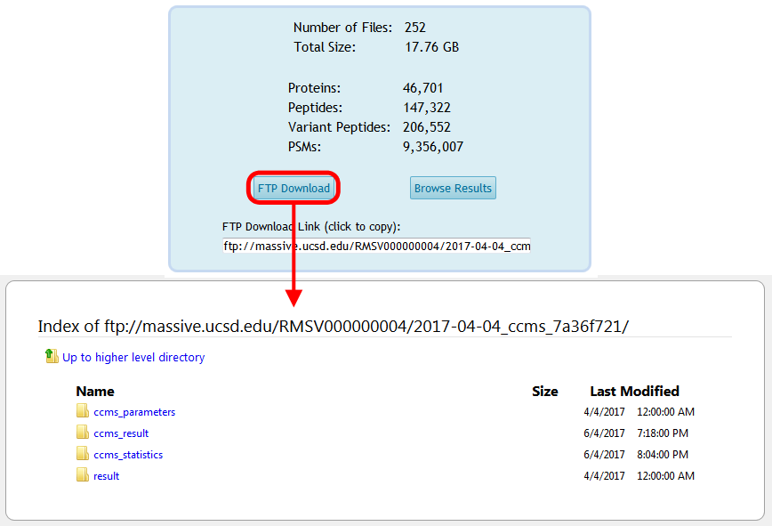
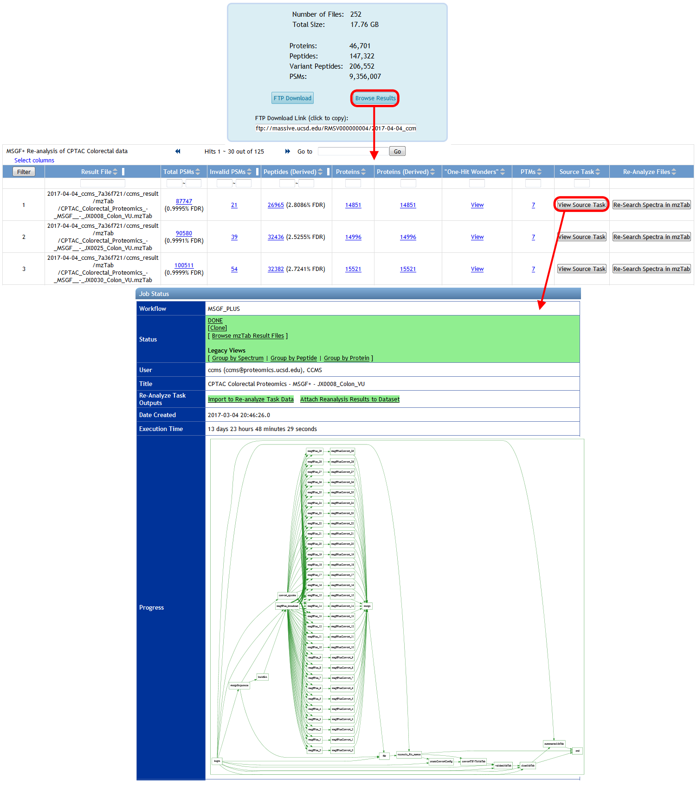

After you've successfully reanalyzed spectrum data from MassIVE, share your findings with the community by attaching your results back to the dataset. There are two ways to do this:

1.  Attach results from a completed ProteoSAFe analysis workflow.
2.  Upload your own results from a search tool run offline.

## Attach ProteoSAFe Reanalysis Results

If you reanalyzed a MassIVE dataset's spectrum files using a [ProteoSAFe workflow](reanalyze_spectra.md), then once that workflow has finished you can attach its results to the original dataset by clicking the "Attach Reanalysis Results to Dataset" link on the job's status page:

This brings you to the MassIVE reanalysis attachment workflow input form, with your analysis task's result files pre-selected:

In this case, MassIVE will do the work of determining which dataset(s) to attach your results to, based on the source spectrum data of your analysis job. Since you ran your ProteoSAFe analysis workflow on spectra from a MassIVE dataset, the system will automatically trace that connection back to find the proper home for your reanalysis.

If you attempt to do this with an analysis job that was not run on dataset spectra, then the system will let you know with an error message.

## Upload Offline Reanalysis Results

If you reanalyzed a MassIVE dataset's spectrum files using offline analysis tools, then you can still attach those results to the proper dataset. Start by [uploading your result files](upload_data.md) to your MassIVE account. Then navigate to the [dataset's web page](access_public_datasets.md#MassIVEDatasetBrowsing-ViewingaDataset) and click the "Add Reanalysis" button:

This brings you to a blank MassIVE reanalysis attachment workflow input form. From here, you can select all the files for your reanalysis by clicking any of the "Select Input Files" buttons:

From the file selection pop-up window, browse your account to select the result files you uploaded, as well as any other files you wish to attach for this reanalysis. Then determine the dataset to attach to by selecting the spectrum files from that dataset that you searched in your offline analysis. You should find that the proper dataset is automatically imported to your account from when you clicked "Add Reanalysis" back on the dataset page.

## Submit Reanalysis Attachment

Once you've selected valid reanalysis files and spectrum files from a public MassIVE dataset, fully configure and submit the rest of your reanalysis attachment job (including [mapping your result files to the dataset's peak list files](submission_workflow.md#MassIVEDatasetSubmission-MappingPeakListandResultFiles)).

The reanalysis attachment workflow will determine which source datasets were reanalyzed, and will then prepare what's referred to as a "reanalysis container" for your attachment. A reanalysis container simply refers to the unique set of datasets that were reanalyzed - usually only one, but possibly more. The workflow then attaches your results to this container. Any other reanalysis results attached (by any user) to this same set of datasets will also go in the same container.

Once the attachment job is finished, both the container and the reanalysis will now show up on the dataset page:

As well as on the page for the container itself (which is always accessible from the dataset):

Each individual reanalysis has its own page, as well (accessible from either the dataset or the container):

And the reanalysis files will be available for download from the container's FTP space:

Finally, you can browse the spectrum identification results for your reanalysis by clicking on "Browse Results" from the reanalysis page, and from there you can trace all the way back to the source ProteoSAFe task that produced each result file, if that's how you generated your results:

