To submit a dataset, first navigate to the official MassIVE repository web site – [http://massive.ucsd.edu/](http://massive.ucsd.edu/). You will then need to log in to your registered MassIVE account.

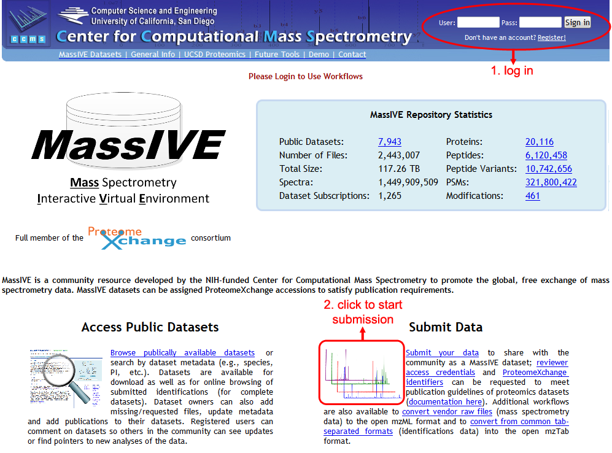

Once logged in, click on “Submit Data” to load the MassIVE submission input page. There are a number of useful workflows available on this page, but to submit a dataset, just be sure that the “MassIVE Dataset Submission” workflow is highlighted in the “Workflow” drop-down menu near the top of the page.

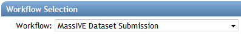

With this workflow selected, you will see an input form including all file and metadata fields relevant to your submission.

### Dataset Metadata

The first section of the submission form pertains to the dataset’s metadata.

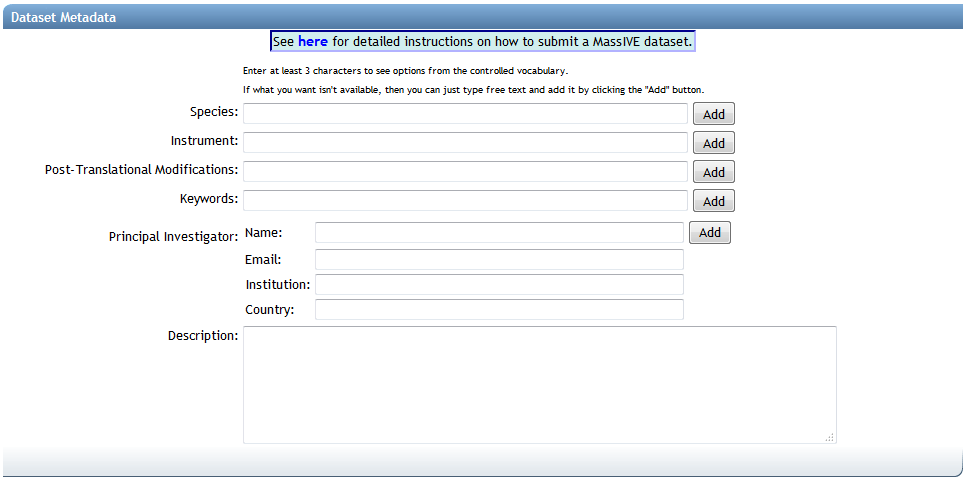

The first three fields (“Species”, “Instrument” and “Post-Translational Modifications”) are backed by lists of standardized controlled vocabulary (“CV”) terms, maintained by organizations such as the [HUPO Proteomics Standards Initiative](http://www.psidev.info/). To search these terms, simply type at least 3 characters into any of these text boxes, and you will be shown a drop-down list of supported terms that match your query. To select a term, simply click it in the drop-down list, and it will be added to your dataset:

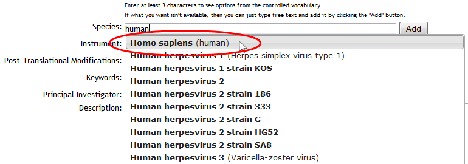

Use the available controls to remove unwanted terms, or add custom ones:

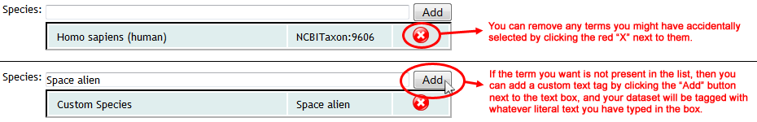

**If the correct CV term for your dataset is present in the list, then it is strongly recommended that you select the official term, rather than entering your own custom text version of it. Using the official controlled vocabulary to tag your dataset greatly increases the likelihood that it will be found and processed correctly by any automated software that may interface with the MassIVE repository.**

For more help on each of the individual metadata categories, see here:

| Metadata Category                | Required | Notes |
| -------------------------------- | -------- | ----- |
| Species                          | Y        | Enter custom text if the correct species for your dataset is not supported in the list. |
| Instrument                       | Y        | Enter custom text if the correct instrument for your dataset is not supported in the list. |
| Post-Translational Modifications | Y        | If your dataset does not include any known post-translational modifications, then there is an appropriate entry in the list to reflect this (“PRIDE:0000398”, “No PTMs are included in the dataset”) |
| Keywords                         | Y        | Your dataset must be tagged with at least one keyword. You can add as many as you wish. Because keywords are always custom text, you **must** click the “Add” button to assign them to your dataset! |
| Principal Investigator           | Y        ||

### Dataset File Selection

The second section of the submission form pertains to the dataset’s files.

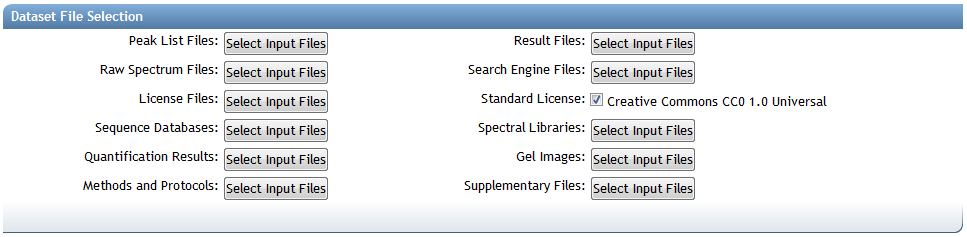

### Submission File Categories

MassIVE dataset files are organized into the following categories when making a submission:

#### Required for Complete Submission

*   Peak List Files – Processed mass spectrum files in a standardized format. The following formats are recognized by MassIVE as valid for this category: mzXML, mzML, and MGF.
*   Result Files – Spectrum identifications in a standardized format. The following formats are recognized by MassIVE as valid for this category: mzIdentML and mzTab.
    *   Most tab-separated spectrum identification file formats can be converted to mzTab using our convenient [TSV conversion workflow](insert tsv to mztab link).

#### Recommended for All Submissions

*   Raw Spectrum Files – Raw mass spectrum files in a non-standard or instrument-specific format, such as Thermo .RAW files, AB Sciex .WIFF files, etc.
*   Search Engine Files – The output of any search engine or data analysis tools or pipelines that were used to analyze this dataset, unless provided in a standardized format recognized by the “Result Files” category (see above).

#### Optional

*   License Files – Specifying how and under what conditions the dataset files may be downloaded and used. Multiple license files may be uploaded, if appropriate.
    *   By default, you can simply leave the “Standard License” checkbox checked and your dataset will be submitted under the default [Creative Commons CC0 1.0 Universal](http://creativecommons.org/publicdomain/zero/1.0/) license. However, if you wish to provide your own license, then you can uncheck this box and then assign your own file to the “License Files” category.
*   Sequence Databases – Any protein or other sequence databases that were searched against in the analysis of this dataset, if applicable (usually .fasta format).
*   Spectral Libraries – Any spectral library files that were searched against in the analysis of this dataset, or that were generated using the spectrum files provided in this dataset, if applicable.
*   Quantification Results – Any data and metadata generated by the analysis software used for performing exclusively the quantification analysis of peptides and proteins.
*   Gel Images – Any gel image files generated, in the event that two-dimensional gel electrophoresis has been used as a separation method.
*   Methods and Protocols – Any open-format files containing explanations or discussions of the experimental procedures used to obtain or analyze this dataset.
*   Supplementary Files – All remaining files belonging to this dataset that do not properly fit into any of the other listed file categories.

**Most of these file categories are not strictly required. The only official file requirement for a MassIVE dataset is that you must submit at least one file in either the “Raw Spectrum Files” or “Peak List Files” categories. However, if your dataset does not meet the additional requirements for a “[complete](#complete-vs-partial-datasets)” submission, then it will be considered only “partial”.**

### Complete vs. Partial Datasets

A MassIVE dataset is considered “complete” by the standards of the [ProteomeXchange](http://www.proteomexchange.org/) consortium if and only if:

*   The dataset includes one or more spectrum identification files in a standardized format, suitable for inclusion within the “Result Files” category described above.
*   Each file submitted in the “Result Files” category contains at least 90% valid spectrum identifications.
    *   An identification is considered “valid” if and only if it meets all of the following criteria:
        *   The identified spectrum can be found within one of the spectrum files submitted within the “Peak List Files” category described above.
        *   The peptide sequence and declared post-translational modifications for the identification can be found and reconstructed with no ambiguity.

The MassIVE dataset submission workflow includes a [file mapping interface](#mapping-peak-list-and-result-files), to ensure that submitted peak list files can be mapped to spectrum references from within the submitted result files. This is how MassIVE is able to find a spectrum in the source file, even if the result file uses a different filename to refer to that source.

If a dataset does not meet the above requirements, then it will be considered “partial” by ProteomeXchange.

### Assigning Uploaded Files to a Dataset

To select files for any of the listed categories, just click on one of the “Select Input Files” buttons to launch a file selector popup window (you may need to instruct your web browser to ignore popups from this site). This window will present you with a view of your MassIVE user account files, as well as an interface with which to assign these files to the various dataset categories.

To add any of your uploaded files to the dataset, simply click individual files or whole folders in the left-hand folder view, and then click on the appropriate file button (in the middle, with the green arrows) to assign them to the relevant category. Files and folders that have been added so far can be seen in the right-hand “Selected Files” view.

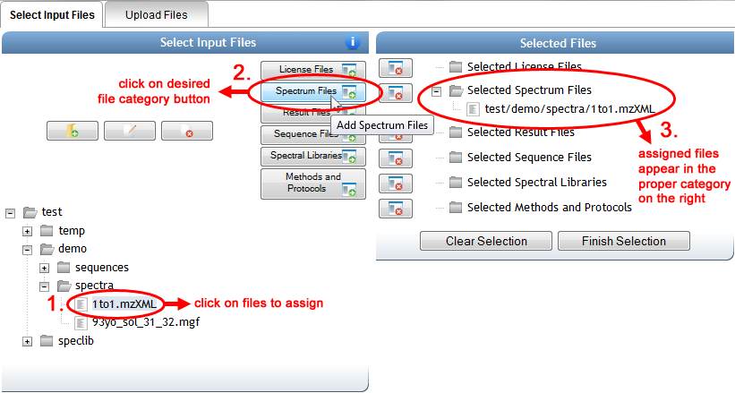

When you are done selecting files, you can either click on “Finish Selection” or simply close the popup window, and the file selections will be noted in blue on the main input form. You can always mouse over this blue text to verify exactly which files have been assigned to that file category.

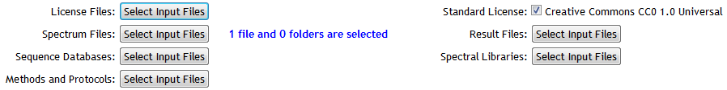

### Mapping Peak List and Result Files

To satisfy the requirements of a “[complete](#MassIVEDatasetSubmission-SubmissionTypes)” dataset, the submission workflow will validate the files in the “Result” category to ensure that all spectrum identifications can be traced back to files in the “Peak List” category. However, it is not always clear to the software which files refer to which, so to clarify this an interface is provided to allow you to manually associate the files.

Once you have [selected](#MassIVEDatasetSubmission-FileAssignment) all of your dataset’s “Result” and “Peak List” files, then you can click on “Start Associating Files” to populate the mapper. The server may need a moment to search through all of your selected “Result” files, collecting all of the spectrum files that they reference, to populate the mapper interface. Once it’s done, you will see a list of your selected “Peak List” files on the left, and all found spectrum file references from within your “Result” files on the right:

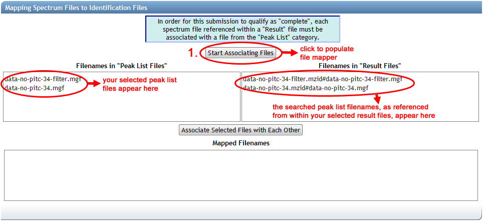

The file references on the right are formatted to display the name of the result file, followed by a hash character (“#”), followed by the name of the spectrum file as specified within the result file. As you might imagine, the names of peak list files uploaded for submission might have changed since they were searched to produce this result file, or the result file may use a different path or file name syntax. This is why manual mapping is often necessary.

**You may find that if the file names match up in advance, then the mapper will pre-map the files according to the matched names. Things are usually easier when you’re organized.**

To link up the file references with the peak list files that they correspond to, simply click on an associated pair, and then click “Associate Selected Files with Each Other”. You can only map one pair of files at a time. As you add each mapping, the corresponding file reference on the right will disappear and the mapping will be added to the box at the bottom. As with metadata, you can remove an unwanted mapping by clicking the red “X”.

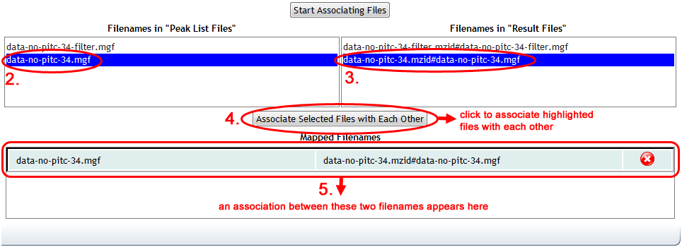

Once all mappings are done, the mapper will indicate completion with a green check mark.

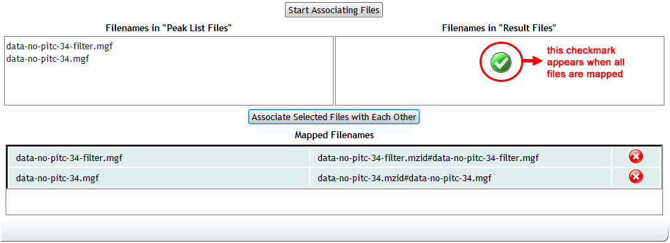

Mapping these files is required for all “[complete](#MassIVEDatasetSubmission-SubmissionTypes)” datasets, which includes any dataset with at least one file in the “Result” category. If you submit files in this category, but do not complete the mapping in the submission form, then the submission will fail.

### Dataset Privacy

All newly submitted MassIVE datasets are by default considered “private”. This means that, although technically anyone can view a dataset’s basic details page (assuming they know the correct URL to that page), a private dataset will never show up in any [public dataset search](http://proteomics.ucsd.edu/service/massive/documentation/access-public-datasets/#MassIVEDatasetBrowsing-Searching). Therefore, it is essentially impossible to find or view a private dataset without knowing its status page URL. This allows submitters to share their private datasets with specific people, such as colleagues or journal reviewers, while still preventing the general public from knowing about the dataset until the submitter is ready to make it public.

The “Dataset Password” field provides an optional extra layer of security. As long as the dataset remains private, this password must be provided to actually connect to the MassIVE FTP server and view or download the dataset’s files. If no password is specified, then the dataset will still be considered private until the submitter decides to make it public, so there is little risk of unauthorized users finding it. The password feature is simply provided for extra security, at the submitter’s discretion.

**Due to implementation requirements for controlled FTP access, even non-password protected datasets are technically given a password. However, all such datasets (including public ones) have the same default public password, which is simply the string “a”. Try entering this if you want to view a public dataset and you are being challenged by the server for password authentication.**

Once a dataset is submitted, its owner (the ProteoSAFe user who launched the submission workflow) can [make it public](#MassIVEDatasetSubmission-MakePublic) at any time by clicking on the “Make Public” link near the top of the status page. Once a dataset is made public, its password is removed (or, more specifically, it is set to the public password “a”), and it then becomes visible in [public dataset searches](http://proteomics.ucsd.edu/service/massive/documentation/access-public-datasets/#MassIVEDatasetBrowsing-Searching).

### Publication to ProteomeXchange

If you check the “Submit to ProteomeXchange” checkbox, then as soon as your dataset becomes public, a ProteomeXchange announcement message will automatically be generated and submitted for your dataset. When this happens, your dataset will show up in the list of publicly accessible datasets at [ProteomeCentral](http://proteomecentral.proteomexchange.org/).

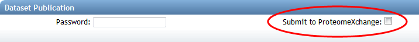

ProteomeXchange, as its name suggests, is a coordination service for the dissemination of proteomics datasets. If your dataset is does not fall within the domain of proteomics, then you probably don’t want to announce it there.

**Even if you check this checkbox, a ProteomeXchange announcement message will not be generated until you actually click “Make Public”.**

### Dataset Submission

When you are ready to submit your dataset, click on the “Submit” button at the bottom of the form, and your dataset will be sent to the MassIVE web server for validation.

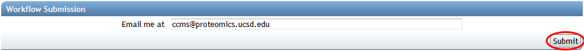

If any problems are found with your input, then you will be notified. Otherwise, you will see the job status page, which will be periodically updated with the current status of your dataset submission workflow. Blue boxes represent activities that have not yet started, orange boxes represent currently running activities, and green boxes represent activities that have completed successfully.

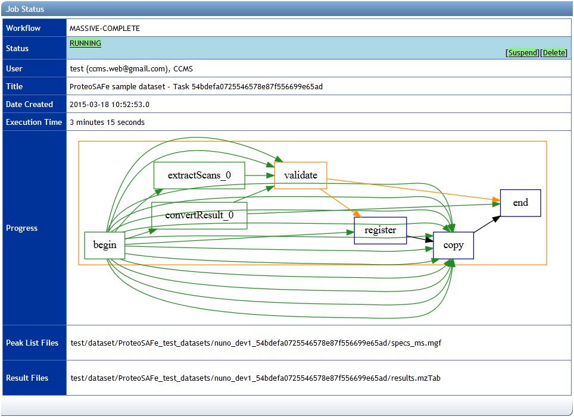

The dataset submission workflow includes steps to process and validate the dataset files, record the details of the dataset in a database, and then securely copy the files to the MassIVE repository. If there is a problem in any step of the workflow, the job will fail and the relevant error messages will be displayed on the status page.
