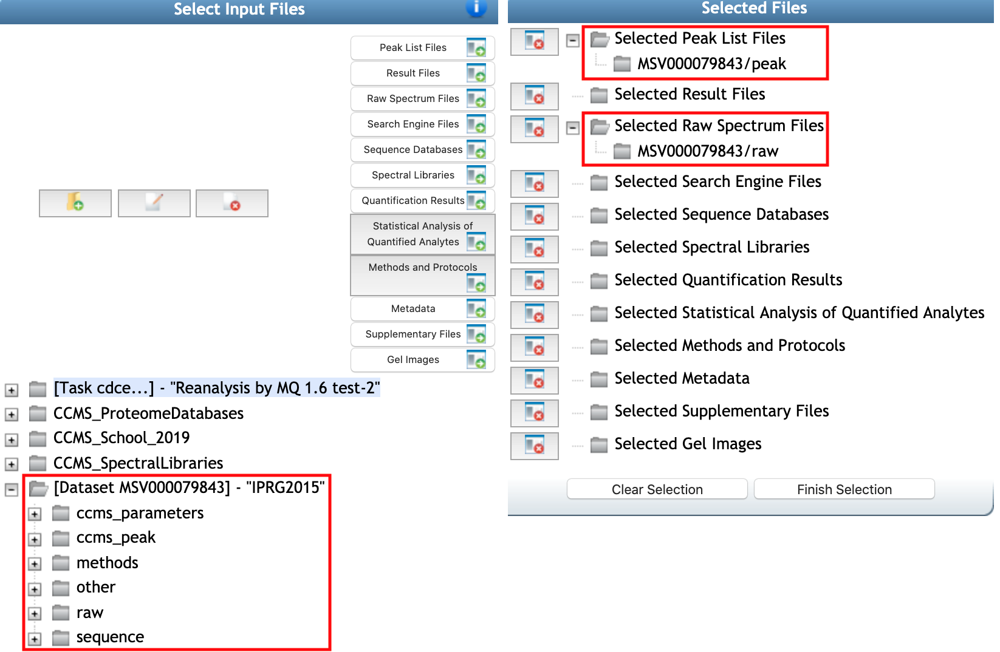
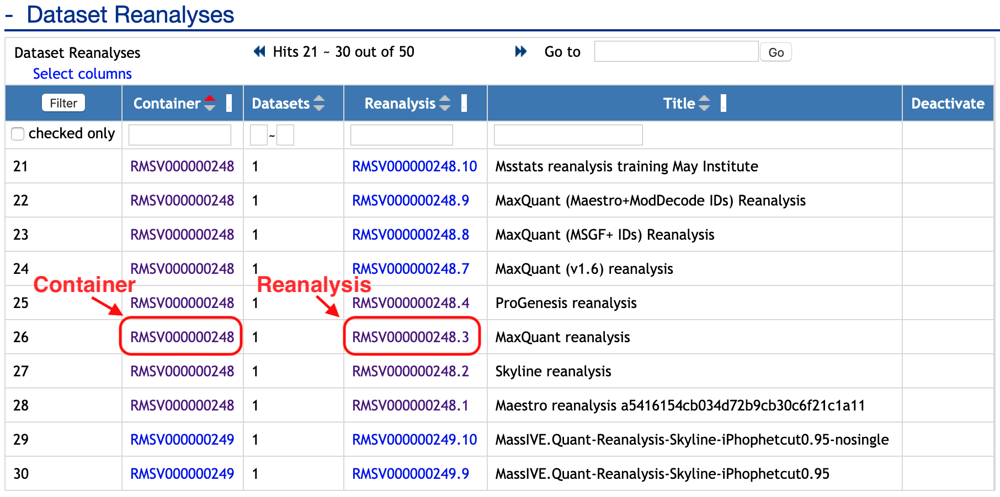
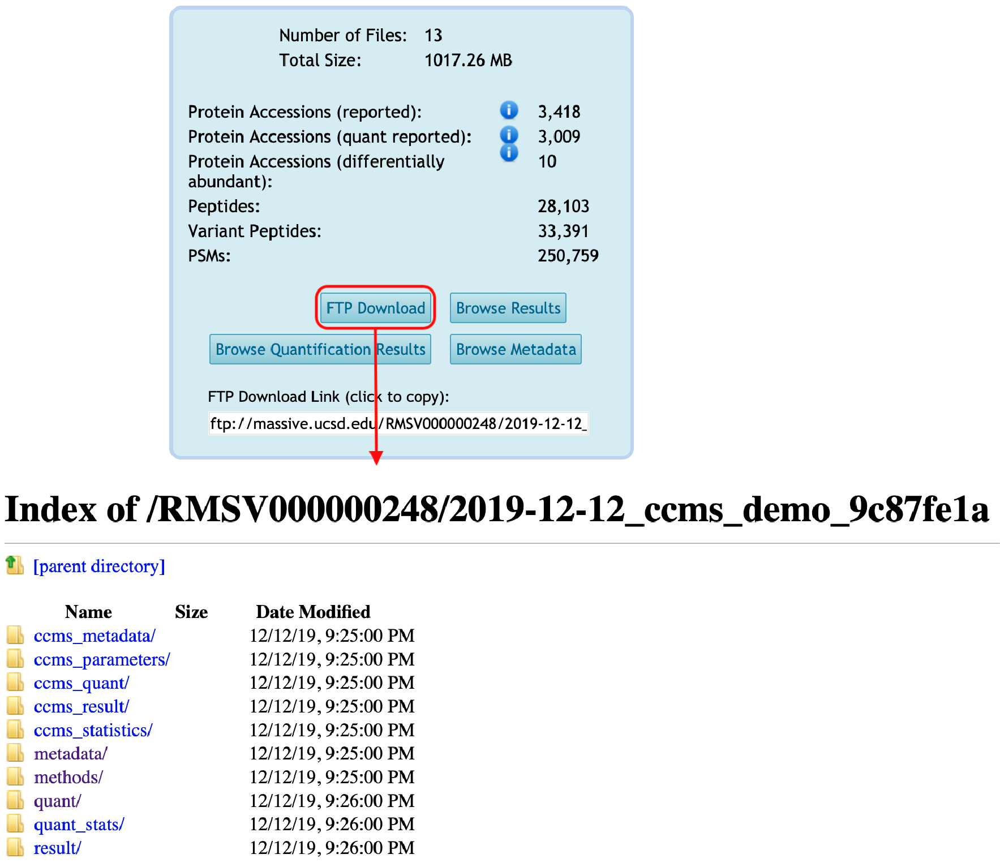

# Submit quantification using offline analysis tool and statistical analysis result

After you've successfully reanalyzed **public data** from MassIVE, share your findings with the community by attaching your results (**quantification and statistical analysis result**) back to the dataset. 

If you reanalyzed a MassIVE dataset's spectrum files and their quantification **using offline analysis tools** (such as Skyline, MaxQuant, Proteome Discoverer, Spectronaut, etc for data processing and R packages, Perseus, etc for statistical analysis), then you can attach those results to the proper dataset. 

**Note: If submit new datasets, check [submit new dataset to MassIVE](https://ccms-ucsd.github.io/MassIVEDocumentation/submit_data/) and follow this documentation for submitting quantification and statistical analysis result.**

## Step 1: Upload your results files to your MassIVE account
Start by [uploading your result files](upload_data.md) to your MassIVE account. 

## Step 2: Add Reanalysis
Then navigate to the [dataset's web page](access_public_datasets.md#MassIVEDatasetBrowsing-ViewingaDataset) and click the "Add Reanalysis" button:

This brings you to a MassIVE reanalysis attachment workflow input form. 

#### Workflow Selection
Automatically, 'MassIVE Dataset: Add Reanalysis Results' should be selected as workflow. You should add the title for this reanalysis in `Title`, such as 'MassIVE.quant reanalysis from offline MaxQuant+MSstats results' 

#### Reanalysis Metadata section
`Species`, `Instrument`, `Post-Translation Modifications` should be filled automatically from original submission. `Description` is required to fill in. It should contain at least 50 characters.

#### Reanalysis File Selection section
From here, you can select all the files for your reanalysis by clicking any of the "Select Input Files" buttons:

Then, file selection window should be popped up. From the file selection pop-up window, browse your account to select the result files you uploaded, as well as any other files you wish to attach for this reanalysis. You should find that the proper dataset is automatically imported to your account from when you clicked "Add Reanalysis" back on the dataset page. You can see that Raw spectrum files and Peak list files which are available in MSV repository are already selected. 

Then you can select valid reanalysis files in this step. Please choose the proper file selection. Here are more help on each of individual categories for quantification and statistical analysis results.

| Category                                     | Notes                                                                                    |
| -------------------------------------------- | ---------------------------------------------------------------------------------------- |
| Quantification results                       | Quantification result files from data processing tools/quantification tools. It should be used for downstream statistical analysis. For example, PSM-level or transition-level or protein-level quantified peak intensities data should be in this category.  |
| Metadata                                     | Information about design of experiments should be submitted in Metadata section. For example, annotation file for MSstats should have the information about biological replicate, technical replicate, fraction, condition or group for the corresponding MS runs and corresponding channels. |
| Statisitical analysis of quantified analytes | Result files for statistical analysis. It could be the table or figure of result for statistical analysis. For example, table (.txt, .csv), r data format for differential abundance analysis or pdf for figures can be saved in this section. |
| Supplementary                                | Any other type of information. For example, the software-specific files from processing software can be shared in this section (sky, skyd, sky.zip, blib, irtdb, protdb, optdb, and midas for Skyline, .pdresult for Proteome Discoverer, .sne for Spectronaut).|

##### Examples : input and output using MSstats for differential abundance analysis

Here are the examples of quantification files and the output of MSstats for statistical analysis and their corresponding categories to submit.

| Data processing tool | File type                | File Selection Category                     |
| -------------------- | ------------------------ | ------------------------------------------- |
| All                  | input.csv                | Quantification results                      |
|                      | annotation.csv           | Metadata                                    |
|                      | testResult_byMSstats.csv | Statistical analysis of quantified analytes |
|                      | msstats.log              | Methods and protocols                       |
|                      | Rscript.R                | Methods and protocols                       |
|                      | Description.pdf          | Methods and protocols                       |
| MaxQuant             | evidence.txt             | Quantification results                      |
|                      | proteinGroups.txt        | Quantification results                      |
|                      | parameters.txt           | Quantification results                      |
|                      | mqpar.xml                | Methods and protocols                       |
|                      | fasta                    | Sequence database                           |
| Spectronaut          | input.xls                | Quantification results                      |
|                      | SpectronautAnalysis.sne  | Supplementary files                         |
| DIA-Umpire           | FragSummary.xls          | Quantification results                      |
|                      | PeptideSummary.xls       | Quantification results                      |
|                      | ProtSummary.xls          | Quantification results                      |
| OpenSWATH            | input.tsv or input.txt   | Quantification results                      |
| Skyline              | .sky.zip                 | Supplementary files                         |

Once you've selected valid reanalysis files and proper categories, click "finish selection" buttons. You will be back to reanalysis attachment workflow input form. 

#### Reanalysis Container Selection section

The reanalysis attachment workflow will determine which source datasets were reanalyzed, and will then prepare what's referred to as a "reanalysis container" for your attachment. A reanalysis container simply refers to the unique set of datasets that were reanalyzed - usually only one, but possibly more. The workflow then attaches your results to this container. Any other reanalysis results attached (by any user) to this same set of datasets will also go in the same container.

For example, `Reanalysis Container` shows all containers for the source dataset. You can choose one of them or make **New reanalysis container**. If you select 'New reanalysis container', then you should put the title for this container in `Reanalysis Container Title`.

#### Mapping Spectrum Files to Identfication Files section

If you submitted new identification files, you should [map your result files to the dataset's peak list files](submission_workflow.md#MassIVEDatasetSubmission-MappingPeakListandResultFiles).

#### Workflow Submission section

Finally, you are ready to submit. Please type your email to get progress notice and click 'submit' buttom.

## Step 3: Reanalysis now shows up on the dataset page

Once the attachment job is finished, both the container and the reanalysis will now show up on the dataset page:

#### Container view
As well as on the page for the container itself (which is always accessible from the dataset):

#### Reanalysis view
Each individual reanalysis has its own page, as well (accessible from either the dataset or the container):

#### Reanalysis files are available for downloading from FTP space
And the reanalysis files will be available for download from the container's FTP space:

#### Browse reanalysis files
You can browse the quantification results for your reanalysis by clicking on "Browse Quantification Results" from the reanalysis page:

Also, you can browse the metadata for your reanalysis by clicking on "Browse Metadata" from the reanalysis page:

