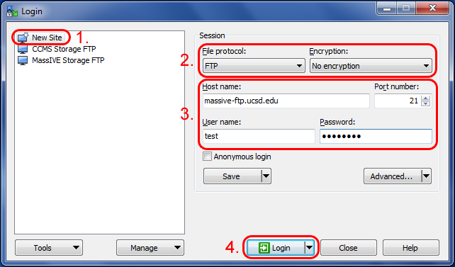
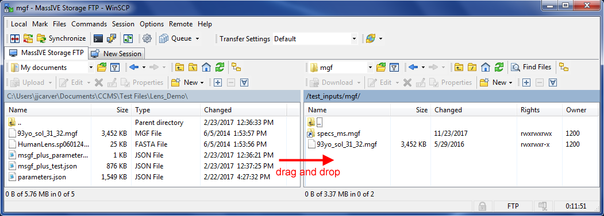

Uploading data for MassIVE repository submission is only available for registered users of the MassIVE web site. For instructions on how to register an account, see [here](account_registration.md#"MassIVE Account Registration").

Once you have a MassIVE web site account, it is strongly recommended that you use FTP to upload your dataset files to your account, as opposed to the MassIVE web interface. This is because the web-based upload interface is optimized for quick uploads of small files, whereas for the much larger files typically associated with MassIVE datasets, FTP is much more stable and robust.

To connect to your MassIVE user account via FTP, simply log on to the FTP server at massive.ucsd.edu, using the same username and password as your MassIVE web account.

| MassIVE FTP Server                   |
| ------------------------------------ |
| [massive.ucsd.edu](https://massive.ucsd.edu) |

To do this, you will need to use your preferred FTP client program. There are many good free FTP clients, but a few of the more popular ones that have been tested with MassIVE include:

[WinSCP](https://winscp.net/eng/index.php) (recommended and used for the example illustrations below)  
[CoreFTP](http://www.coreftp.com/)  
[CoffeeCup Free FTP](http://www.coffeecup.com/free-ftp/)

_Note: We no longer recommend FileZilla, since it was found to contain malware in a recent update._

Most FTP client programs use a similar interface. There is usually some sort of server or session management interface, allowing you to set up and store your connection information for a particular FTP server, and then re-connect to that server easily. For example, in WinSCP:

When setting up your FTP server connection, be sure to use plain FTP with no encryption. Then enter massive.ucsd.edu as the server or “host” name (port 21), followed by your MassIVE username and password, and the client should connect you to your user file space.

From there, you can upload files by finding them on your computer (usually in the left panel) and then dragging them over to the server (usually in the right panel), or you can download files from the server to your computer by dragging them in the reverse direction.

You can also experiment with the FTP client interface to move and rename files and folders on the server, so as to reorganize your uploaded data in whatever manner you prefer.

If you have any questions about any part of the MassIVE file upload process, please feel free to email [ccms-web@cs.ucsd.edu](mailto:ccms-web@cs.ucsd.edu) for more information.
