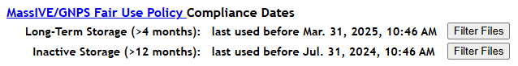

### User File Management
To view, sort, and delete files and folders in your account's private storage space, just log in and click the "User Files" link in the site banner:

This will show a table listing all of the files and folders currently in your account's private storage space.

_Note: It may take some time to load this page, since the system checks all your account's files and folders to populate this interface._

From this table, you can sort and/or filter on any column to find the files you want, and you can delete either individual files or entire folders via the "Delete" button in each row.

### Fair Use Policy Compliance

Please note that all files shown in this web interface are actual files taking up space in your account's private storage space, and therefore contribute to your account's [MassIVE/GNPS Fair Use Policy](fair_use_policy.md) compliance. Any files already submitted in a MassIVE dataset will no longer be shown here, since they have been moved out of your account and into the MassIVE repository (see our [Fair Use Policy FAQ](fair_use_policy_faq.md) for more details on this, particularly questions #1 and #7).

To filter this list specifically for unsubmitted files that are currently in violation of the Fair Use Policy, please use the filter buttons near the top of this page. The dates shown here clarify exactly how old a file needs to be in order to fall into one the two main compliance categories:

**NOTE: This example screenshot taken July 31, 2025 - your dates will differ based on exactly when you load this page.**

Clicking one of these buttons will filter the table below to only show files with a "Last Used" date prior to the specified compliance threshold. This allows you to quickly identify non-compliant files for cleanup purposes.

#### Tips
- Please keep in mind that files within the "Long-Term Storage" compliance category (i.e. between 4 and 12 months old) are allowed - as long as the total space occupied by these files is 100 GB or less. Files less than 4 months old can take up as much space as you need. Even extremely large datasets (i.e. multiple terabytes in size) should be ready for submission and/or data analysis within 4 months of their initial upload.
- All files greater than 12 months in age are considered non-compliant - even if they are 0 bytes in size. Your account's storage space is intended for actively used files only.
- The policy compliance filter buttons do not clear any additional filters you may have manually added to the table below. Please be aware that if you've already filtered the table, these buttons alone may not show you all files currently out of compliance. Use the "Clear Filters" button to ensure your filter starts from scratch.
- If you see files listed in this web interface that should no longer be taking up space in your account (i.e. you are certain you either already deleted them or included them in a successful MassIVE dataset submission), please contact us at [ccms@proteomics.ucsd.edu](mailto:ccms@proteomics.ucsd.edu) to report this issue.
