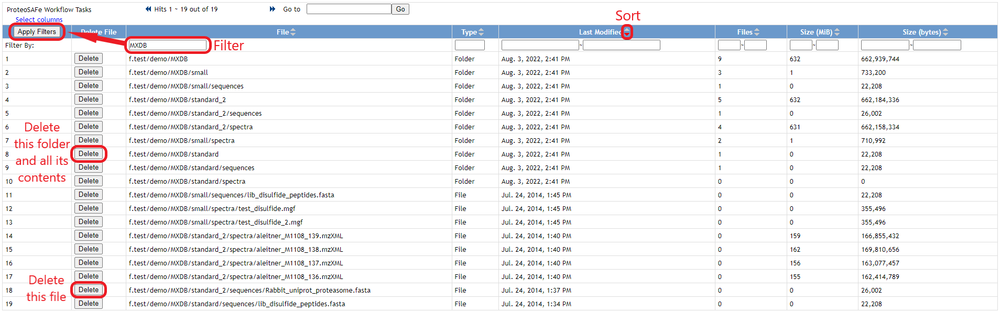

### User File Management
To view, sort, and delete files and folders in your account's private storage space, just log in and click the "User Files" link in the site banner:

This will show a table listing all of the files and folders currently in your account's private storage space.

_Note: It may take some time to load this page, since the system checks all your account's files and folders to populate this interface._

From this table, you can sort and/or filter on any column to find the files you want, and you can delete either individual files or entire folders via the "Delete" button in each row.

